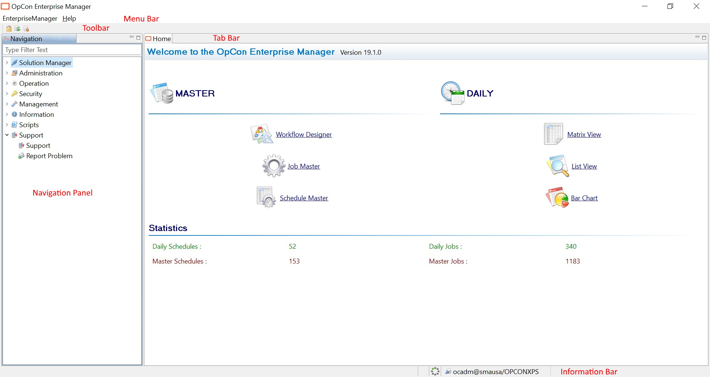

# Understanding the User Interface Layout {#understanding-the-user-interface-layout style="margin-bottom: 8pt;"}

[]{#aanchor98} When the Enterprise Manager is opened for the first time, it opens to the Home screen. The Home screen provides the version number
of the currently installed Enterprise Manager software at the top of the
screen, and an indication of the number of schedules and jobs contained
in both the Daily and the Master tables displays at the bottom of the
screen. The left-hand side of the Home screen (also referred to as the
[Navigation Panel]{.GeneralNavigation}) provides the navigation topics, and the center of the Home screen provides links to the frequently used
navigated topics.

 

Enterprise Manager Home Screen

 

The Enterprise Manager screen layout includes and/or utilizes:

-   [[Menus](Menus.md)]{.Hyperlink}
-   [[[Navigation     Panel]{.GeneralNavigation}](Navigation-Panel.md)]{.Hyperlink}
-   [[Information Bar](Information-Bar.md)]{.Hyperlink}
-   [Keyboard Shortcuts](Keyboard-Shortcuts.md)
:::

 

