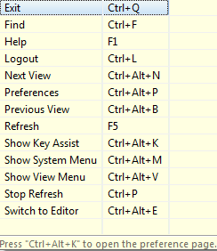

# Keyboard Shortcuts

##  []{#Enterprise_Manager}Enterprise Manager 
In Enterprise Manager, the[ F1]{._Override style="font-weight: bold;"} Keyboard shortcut will link to the conceptual information for the
current location in Enterprise Manager. From the main screen, this
option opens to the first page of the Enterprise Manager Guide user
help.

 

The following are principal shortcuts from the tools on the Enterprise
Manager banner page:

+-------------------------+---------------+-------------------------+
| ![Lockout               | Logout        | [Ctrl+L]{._Override     | | icon](../../.           |               | styl                    |
| ./Resources/Images/EM/l |               | e="font-weight: bold;"} |
| ock.png "Lockout icon") |               | (confirm logout)        |
|                         |               |                         |
|                         |               | [Ctrl+Q]{._Override     | |                         |               | styl                    |
|                         |               | e="font-weight: bold;"} |
|                         |               | (automatic logout)      |
+-------------------------+---------------+-------------------------+
| ![Refresh               | Refresh       | [F5]{styl               | | icon](../../../R        |               | e="font-weight: bold;"} |
| esources/Images/EM/refr |               |                         |
| esh.png "Refresh icon") |               |                         |
+-------------------------+---------------+-------------------------+
|  |               |                         |
+-------------------------+---------------+-------------------------+

 

In Enterprise Manager, [Ctrl+Alt+K]{._Override style="font-weight: bold;"} (Show Key Assist) will display the following
shortcut menu:

The following [Ctrl+Alt+]{._Override style="font-weight: bold;font-style: normal;"} character keyboard
shortcuts access the [Preference]{._Override style="font-style: italic;"} and [System]{._Override
style="font-style: italic;"} menus and [switch between views]{._Override style="font-style: normal;"}.

+------------+--------------------------------------------------------+
| Ctrl+Alt+B | [Go to previous views when multiple views are open in  | |            | Enterprise Manager]{._Override                         |
|            | style="line-height: 12pt;"}                            |
+------------+--------------------------------------------------------+
| Ctrl+Alt+E | [Switch between editors when multiple editors are open | |            | in Enterprise Manager]{._Override                      |
|            | style="line-height: 12pt;"}                            |
+------------+--------------------------------------------------------+
| Ctrl+Alt+K | Display the list of shortcuts [- or -]{._Override      | |            | style="fon                                             |
|            | t-weight: bold;font-style: italic;line-height: 13pt;"} |
|            |                                                        |
|            | Within the [Help]{._Override                           | |            | style="font-weight: bold;"} menu, select [Show Key     |
|            | Assist]{._Override style="font-style: italic;"} to     |
|            | display the list of shortcuts                          |
+------------+--------------------------------------------------------+
| Ctrl+Alt+M | [Display the system menu for the current               | |            | view/editor]{._Override style="line-height: 12pt;"}    |
+------------+--------------------------------------------------------+
| Ctrl+Alt+N | Go to the next view when multiple views are open in    |
|            | Enterprise Manager                                     |
+------------+--------------------------------------------------------+
| Ctrl+Alt+P | [Go to the Preferences screen in Enterprise            | |            | Manager]{._Override style="line-height: 12pt;"}        |
+------------+--------------------------------------------------------+
| Ctrl+Alt+V | [Display the View menu]{._Override                     | |            | style="line-height: 12pt;"}                            |
+------------+--------------------------------------------------------+

## Schedule Master and Job Master

The following [Alt +]{._Override style="font-weight: bold;"} and [Ctrl +]{._Override style="font-weight: bold;"} character keyboard shortcuts
access required fields in editors within the [Schedule Master]{._Override style="font-style: italic;"} and [Job
Master]{._Override style="font-style: italic;"}:

  ---------------------------------------------------------------------------- ----------------- ----------------------------------------------------------------------------------------------------------
  n/a                                                                          **Alt+N**         [Go to the]{._Override style="font-style: normal;"} Name[ field]{._Override style="font-style: normal;"}                  **Ctrl+N**        [Add]{._Override style="line-height: 12pt;"}
        **Ctrl+R**        Cancel
     **Ctrl+Insert**   Copy
              **Ctrl+F**        Find
        **Ctrl+D**        Remove
              **Ctrl+S**        [Save]{._Override style="line-height: 12pt;"}
  ---------------------------------------------------------------------------- ----------------- ----------------------------------------------------------------------------------------------------------

## Frequency

  ------- -------------------------------------------------
  Alt+A   [Add]{._Override style="line-height: 12pt;"}   Alt+R   [Remove]{._Override style="line-height: 12pt;"}
  Alt+E   Edit
  Alt+F   Forecast
  Alt+C   Forecast All
  Alt+D   Advanced
  ------- -------------------------------------------------

## Events

  ------- ---------------------------------------------------------------------------
  Alt+A   [Add]{._Override style="line-height: 12pt;"}   Alt+R   [Remove]{._Override style="line-height: 12pt;"}
  Alt+E   Edit
  Alt+J   Select [Job Related]{._Override style="font-style: italic;"} Events   Alt+F   Select [Frequency Related]{._Override style="font-style: italic;"} Events
  ------- ---------------------------------------------------------------------------

## Threshold/Resource Update

  ------- ------------------------------------------------------------------------
  Alt+A   [Add]{._Override style="line-height: 12pt;"}   Alt+R   [Remove]{._Override style="line-height: 12pt;"}
  Alt+E   Edit
  Alt+J   Select [Job Related]{._Override style="font-style: italic;"} T/R   Alt+F   Select [Frequency Related]{._Override style="font-style: italic;"} T/R
  ------- ------------------------------------------------------------------------

## Dependencies

  ------- -----------------------------------------------------------------------------------
  Alt+A   [Add]{._Override style="line-height: 12pt;"}   Alt+R   [Remove]{._Override style="line-height: 12pt;"}
  Alt+E   Edit
  Alt+J   Select/clear [Job Related]{._Override style="font-style: italic;"} checkbox   Alt+F   Select/clear [Frequency Related]{._Override style="font-style: italic;"} checkbox
  ------- -----------------------------------------------------------------------------------

## General Job Details

  ------- -------------------------------------------------------------------------------------------------------------------------
  Alt+P   [Go to]{._Override style="font-style: normal;"} Primary Machine[ field]{._Override style="font-style: normal;"}   Alt+G   [Go to]{._Override style="font-style: normal;"} Machine Group Selection[ field]{._Override style="font-style: normal;"}
  ------- -------------------------------------------------------------------------------------------------------------------------

## BIS Details

  ------- --------------------------------------------------------------------------------------------------------
  Alt+R   [Go to]{._Override style="font-style: normal;"} Run ID[ field]{._Override style="font-style: normal;"}   ------- --------------------------------------------------------------------------------------------------------

## Container Details

  ------- -----------------------------------------------------------------------------------------------------------------------
  Alt+S   [Go to]{._Override style="font-style: normal;"} SubSchedule [selection field]{._Override style="font-style: normal;"}   ------- -----------------------------------------------------------------------------------------------------------------------

## File Transfer Details

  ------- ---------------------------------------------------------------------------------------------------------------------
  Alt+S   [Go to]{._Override style="font-style: normal;"} Source Machine[ field]{._Override style="font-style: normal;"}   Alt+D   [Go to]{._Override style="font-style: normal;"} Destination Machine[ field]{._Override style="font-style: normal;"}
  Alt+P   Select/clear [Fail if preferred settings not satisfied]{._Override style="font-style: italic;"} checkbox   Alt+T   (Options tab) Go to the [Source Data Type]{._Override style="font-style: italic;"} Field
  ------- ---------------------------------------------------------------------------------------------------------------------

## IBM i Details

  ------- --------------------------------------------------------------------------------------
  Alt+J   (Job Information tab) Go to [Job Type]{._Override style="font-style: italic;"} field   Alt+C   (Call Information Tab) Go to [Call]{._Override style="font-style: italic;"} field
  Alt+A   (Messages Tab) Go to [Add]{._Override style="font-style: italic;"} button   Alt+R   (Messages Tab) Go to [Remove]{._Override style="font-style: italic;"} button
  Alt+U   (Messages Tab) Go to [Update]{._Override style="font-style: italic;"} button   Alt+A   (Spool Files Tab) Go to [Add]{._Override style="font-style: italic;"} button
  Alt+R   (Spool Files Tab) Go to [Remove]{._Override style="font-style: italic;"} button   Alt+U   (Spool Files Tab) Go to [Update]{._Override style="font-style: italic;"} button
  ------- --------------------------------------------------------------------------------------

## MCP Details

  ------- --------------------------------------------------------------------------------
  Alt+F   Go to [File Title]{._Override style="font-style: italic;"} in Job Details   Alt+T   Go to [File Title]{._Override style="font-style: italic;"} in Pre-Run Details
  Alt+C   Go to [Fail Codes]{._Override style="font-style: italic;"} in Failure Criteria   ------- --------------------------------------------------------------------------------

## OpenVMS Details

  ------- ------------------------------------------------------------
  Alt+U   Go to [User]{._Override style="font-style: italic;"} field   ------- ------------------------------------------------------------

## OS 2200 Details

  ------- ----------------------------------------------------------------------------------
  Alt+Q   Go to [Qualifier]{._Override style="font-style: italic;"} field in Start Command   ------- ----------------------------------------------------------------------------------

## SAP BW Details

  ------- --------------------------------------------------------------------------
  Alt+C   Go to [Process Chain Name]{._Override style="font-style: italic;"} field   ------- --------------------------------------------------------------------------

## SAP R/3 Details

  ------- ----------------------------------------------------------------
  Alt+J   Go to [Job Name]{._Override style="font-style: italic;"} field   Alt+W   Go to [New]{._Override style="font-style: italic;"} button
  Alt+E   Go to [Edit]{._Override style="font-style: italic;"} button   ------- ----------------------------------------------------------------

## UNIX Details

  ------- -------------------------------------------------------------------
  Alt+S   Go to [Start Image]{._Override style="font-style: italic;"} field   ------- -------------------------------------------------------------------

## Windows Details

  ------- ---------------------------------------------------------------
  Alt+U   Go to [User ID]{._Override style="font-style: italic;"} field   ------- ---------------------------------------------------------------

## z/OS Details

  ------- ---------------------------------------------------------------------
  Alt+J   Go to [z/OS Job Type]{._Override style="font-style: italic;"} field   ------- ---------------------------------------------------------------------

## Calendars

  ------- ------------------------------------------------------------
  Alt+N   Go to [Name]{._Override style="font-style: italic;"} field   ------- ------------------------------------------------------------

## Global Properties

  ------- ------------------------------------------------------------
  Alt+N   Go to [Name]{._Override style="font-style: italic;"} field   ------- ------------------------------------------------------------

## Thresholds

  ------- ------------------------------------------------------------
  Alt+N   Go to [Name]{._Override style="font-style: italic;"} field   ------- ------------------------------------------------------------

## Resources

  ------- ------------------------------------------------------------
  Alt+N   Go to [Name]{._Override style="font-style: italic;"} field   ------- ------------------------------------------------------------

## Machines

  ------- ---------------------------------------------------------------------
  Alt+N   Go to [Name]{._Override style="font-style: italic;"} field   Alt+S   Go to [Socket Number]{._Override style="font-style: italic;"} field
  ------- ---------------------------------------------------------------------

## Machine Groups

  ----------- ---------------------------------------------------------------------------------------------------------------------------------------------------------------------------------------------------------------------------------------------------------------------------------------------------------------------
  Alt+N       Go to [Name]{._Override style="font-style: italic;"} field   Enter Key   Enable the [Enter]{._Override style="font-weight: bold;"} key to move a selected item from [Unassigned]{._Override style="font-style: italic;"} to [Assigned]{._Override style="font-style: italic;"} or [Assigned]{._Override style="font-style: italic;"} to [Unassigned]{._Override style="font-style: italic;"}
  ----------- ---------------------------------------------------------------------------------------------------------------------------------------------------------------------------------------------------------------------------------------------------------------------------------------------------------------------

## Server Options

  ------- -----------------------------------------------------------------
  Alt+U   Go to [Update]{._Override style="font-style: italic;"} button   Alt+D   Go to [Defaults]{._Override style="font-style: italic;"} button
  ------- -----------------------------------------------------------------

## Roles

  ----------- ---------------------------------------------------------------------------------------------------------------------------------------------------------------------------------------------------------------------------------
  Alt+N       Go to [Name]{._Override style="font-style: italic;"} field   Enter Key   Enable the [Enter]{._Override style="font-weight: bold;"} key to move a selected item from **Revoked** to [Granted]{._Override style="font-style: italic;"} or [Granted]{._Override style="font-style: italic;"} to **Revoked**
  ----------- ---------------------------------------------------------------------------------------------------------------------------------------------------------------------------------------------------------------------------------

## User Accounts

  ----------- ---------------------------------------------------------------------------------------------------------------------------------------------------------------------------------------------------------------------------------
  Alt+N       Go to [Name]{._Override style="font-style: italic;"} field   Enter Key   Enable the [Enter]{._Override style="font-weight: bold;"} key to move a selected item from **Revoked** to [Granted]{._Override style="font-style: italic;"} or [Granted]{._Override style="font-style: italic;"} to **Revoked**
  ----------- ---------------------------------------------------------------------------------------------------------------------------------------------------------------------------------------------------------------------------------

## Batch Users

  ------- ------------------------------------------------------------------------
  Alt+S   Go to [Select Target OS]{._Override style="font-style: italic;"} field   ------- ------------------------------------------------------------------------

## Departments

  ------- ------------------------------------------------------------
  Alt+N   Go to [Name]{._Override style="font-style: italic;"} field   ------- ------------------------------------------------------------

## Access Codes

  ------- ------------------------------------------------------------
  Alt+N   Go to [Name]{._Override style="font-style: italic;"} field   ------- ------------------------------------------------------------

## Access Code Privileges

  ----------- ---------------------------------------------------------------------------------------------------------------------------------------------------------------------------------------------------------------------------------
  Alt+U       Go to [Allow Job Updates]{._Override style="font-style: italic;"} field   Enter Key   Enable the [Enter]{._Override style="font-weight: bold;"} key to move a selected item from **Revoked** to [Granted]{._Override style="font-style: italic;"} or [Granted]{._Override style="font-style: italic;"} to **Revoked**
  ----------- ---------------------------------------------------------------------------------------------------------------------------------------------------------------------------------------------------------------------------------

## Schedule Privileges

  ----------- ---------------------------------------------------------------------------------------------------------------------------------------------------------------------------------------------------------------------------------
  Enter Key   Enable the [Enter]{._Override style="font-weight: bold;"} key to move a selected item from **Revoked** to [Granted]{._Override style="font-style: italic;"} or [Granted]{._Override style="font-style: italic;"} to **Revoked**   ----------- ---------------------------------------------------------------------------------------------------------------------------------------------------------------------------------------------------------------------------------

## Function Privileges

  ----------- ---------------------------------------------------------------------------------------------------------------------------------------------------------------------------------------------------------------------------------
  Enter Key   Enable the [Enter]{._Override style="font-weight: bold;"} key to move a selected item from **Revoked** to [Granted]{._Override style="font-style: italic;"} or [Granted]{._Override style="font-style: italic;"} to **Revoked**   ----------- ---------------------------------------------------------------------------------------------------------------------------------------------------------------------------------------------------------------------------------

## Departmental Function Privileges

  ----------- ---------------------------------------------------------------------------------------------------------------------------------------------------------------------------------------------------------------------------------
  Enter Key   Enable the [Enter]{._Override style="font-weight: bold;"} key to move a selected item from **Revoked** to [Granted]{._Override style="font-style: italic;"} or [Granted]{._Override style="font-style: italic;"} to **Revoked**   ----------- ---------------------------------------------------------------------------------------------------------------------------------------------------------------------------------------------------------------------------------

## Batch User Privileges

  ----------- ---------------------------------------------------------------------------------------------------------------------------------------------------------------------------------------------------------------------------------
  Enter Key   Enable the [Enter]{._Override style="font-weight: bold;"} key to move a selected item from **Revoked** to [Granted]{._Override style="font-style: italic;"} or [Granted]{._Override style="font-style: italic;"} to **Revoked**   ----------- ---------------------------------------------------------------------------------------------------------------------------------------------------------------------------------------------------------------------------------

## Machine Privileges

  ----------- ---------------------------------------------------------------------------------------------------------------------------------------------------------------------------------------------------------------------------------
  Alt+U       Go to [Allow Job Updates]{._Override style="font-style: italic;"} field   Enter Key   Enable the [Enter]{._Override style="font-weight: bold;"} key to move a selected item from **Revoked** to [Granted]{._Override style="font-style: italic;"} or [Granted]{._Override style="font-style: italic;"} to **Revoked**
  ----------- ---------------------------------------------------------------------------------------------------------------------------------------------------------------------------------------------------------------------------------

## Machine Group Privileges

  ----------- ---------------------------------------------------------------------------------------------------------------------------------------------------------------------------------------------------------------------------------
  Alt+U       Go to [Allow Job Updates]{._Override style="font-style: italic;"} field   Enter Key   Enable the [Enter]{._Override style="font-weight: bold;"} key to move a selected item from **Revoked** to [Granted]{._Override style="font-style: italic;"} or [Granted]{._Override style="font-style: italic;"} to **Revoked**
  ----------- ---------------------------------------------------------------------------------------------------------------------------------------------------------------------------------------------------------------------------------

 
:::

 

