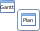

#  Using Operation Tools

The Operation tools will perform the functions specified below,
depending on the view in which you are currently working.

  ----------------------------------------------------------------------------------------------------------------------------------------- ------------------------------------------------------------------------------------------------------------------------------------------------------------------------------------------------------------------------------------------------------------------------------------------------------------------------------------------------------------------------------------------------------------------------------------------------------------------------------------------------------------------------------------------ -- --
                                                          **[]{#Job_Filter}Job Filter**: This tool provides filtering options for Dates, Job Statuses, Departments, Access Codes, and Tags.                                                                                                                                                                                                                                                                                                                                                                                                             
                               **[]{#Listen_For_selection_changes_in_other_views}Listen for selection changes in other views**: This tool must be activated in the **Gantt**, **Bar Chart**, **Pie Chart**, and **Workload Chart** views in order to view the Dates, Schedules, and/or Jobs information sent from the **List**, **Matrix**, and **PERT** views. The listener updates the display when dates then schedules are selected in sending views. Additionally, the listener can only synchronize the view for items in the current display.                         
                                                       **[]{#Arrange_All}Arrange All**: In the **PERT** view, this tool rearranges all items on the display to the selected layout option.                                                                                                                                                                                                                                                                                                                                                                                                           
                                   **[]{#Group_by_Schedules}Group by Schedules**: This tool groups the job boxes by schedule and displays a box around each group for the schedules. Turn this tool off to layout all jobs together. This tool has the biggest impact when more than one schedule is in the layout.                                                                                                                                                                                                                                                              
                                                  **[]{#Open_mini_map}Open mini map**: This tool displays a miniature view of the entire **PERT** map of the schedule. There is a small window on top of the map that allows you to move the currently selected section for display on the main designer area.                                                                                                                                                                                                                                                                                  
                                **[]{#Send_the_current_selection_to_other_views}Send the current selection to other views**: This tool must be activated in the **List**, **Matrix**, and **PERT** views in order to send the Dates, Schedules, and/or Jobs information to the **Gantt**, **Bar Chart**, **Pie Chart**, and **Workload Chart** views. The data sends based on date selection first, then selection of a schedule.                                                                                                                                             
                         **[]{#Show_empty_schedules/subschedules}Show empty schedules/sub-schedules**: This tool will show only the dates that have schedules or subschedules in the Daily tables that are empty. Clicking the button a second time will hide the dates.                                                                                                                                                                                                                                                                                               
                                                     **[]{#Expand_All}Expand All**: This tool will expand all parts of the tree that are not currently expanded.                                                                                                                                                                                                                                                                                                                                                                                                                                   
                                                    **[]{#Collapse_All}Collapse All**: This tool will collapse all portions of the tree that are currently expanded.                                                                                                                                                                                                                                                                                                                                                                                                                              
                                            **[]{#Show_all_jobs_for_the_day}Show all jobs for the day**: This tool will display all jobs on the schedules for the selected day.                                                                                                                                                                                                                                                                                                                                                                                                           
                                              **[]{#Resize_Columns}Resize Columns**: This tool will resize the columns of the job grid that may have been altered.                                                                                                                                                                                                                                                                                                                                                                                                                          
                                 **[]{#Show/Hide_the_header_containing_the_calendar}Show/Hide the header containing the calendar**: This tool will cause the left portion of the display including the Date selector, the Schedule selector and minimap section to disappear. Clicking this button a second time will cause those sections to reappear.                                                                                                                                                                                                                        
                                                                     **[]{#Export_to_CSV_file}Export to CSV file**: This tool (on the Matrix screen) will open the **Export Report to CSV** dialog in order to provide the export comma-separated value format and export information.                                                                                                                                                                                                                                                                                                                             
                                                                           **[]{#Find}Find** (Ctrl+F): This tool will open the 'Find' window to find an item in the display (e.g., Job, Threshold, Resource, etc.).                                                                                                                                                                                                                                                                                                                                                                                                    
                                     **[]{#Show_Dependencies}Show Dependencies**: This tool will show the dependencies (lines) between jobs. Clicking the button a second time will clear the dependency lines. An After dependency will be indicated by a blue line, a Conflict dependency will be indicated by a red line).                                                                                                                                                                                                                                                      
             **[]{#Show_Cross_Schedules_dependencies}Show Cross Schedules dependencies**: This tool will display the dependencies (if they exist) from a job in one schedule to a job in a second schedule. If the button is clicked a second time, the display reverts to the original schedule without showing the cross schedule dependency.                                                                                                                                                                                                            
                              **[]{#Jump_to_the_earliest_job}Jump to the earliest job**: This tool will move the time segment for the earliest job to display at the left hand side of the screen.                                                                                                                                                                                                                                                                                                                                                                          
                                               **[]{#Mode_Plan}Mode Plan**: This tool will place the view into Plan mode (the button name on the toolbar will change to "Plan" as opposed to "Gantt"). In Plan mode, you can change the estimate time taken by a job or change the estimated start time of the schedule. While in Plan mode, the **Listen for selection changes in other views** button and the **Show dependencies** button will be disabled. Click on the **Plan mode** button to clear the plan mode (the button name on the toolbar changes back to "Gantt").      
                             **[]{#Follow_the_current_date}Follow the current date**: This tool will place a orange line down the center of the display and it will reflect the current date and time.                                                                                                                                                                                                                                                                                                                                                                     
       **[]{#Change_Chart_between_tube/bars}Change Chart between tube/bars**: This tool will change the display from bars to tubes or tubes to bars depending on the current display.                                                                                                                                                                                                                                                                                                                                                                
                                                               **[]{#Previous}Previous**: This tool will change the display to the previous selection.                                                                                                                                                                                                                                                                                                                                                                                                                                                       
                                                                        **[]{#Print}Print**: In the **Workflow Designer** and **PERT** view, this tool will display the options to print the layout.                                                                                                                                                                                                                                                                                                                                                                                                                  
                                         **[]{#Show/Hide_Legend}Show/Hide Legend**: This tool will show or hide the legend depending on the current display.                                                                                                                                                                                                                                                                                                                                                                                                                           
                      **[]{#Render_chart_with_depth}Render chart with depth**: This tool will change the display to have depth or no depth depending on the current display.                                                                                                                                                                                                                                                                                                                                                                                        
                  **[]{#Render_chart_translucent}Render chart translucent**: This tool will change the display to be translucent or non-translucent depending on the current display.                                                                                                                                                                                                                                                                                                                                                                           
                                           **[]{#Transpose_the_chart}Transpose the chart**: This tool will transpose the horizontal and vertical axis.                                                                                                                                                                                                                                                                                                                                                                                                                                   
                                          **[]{#Show/Hide_labels}Show/Hide labels**: This tool will show or hide the labels from the display.                                                                                                                                                                                                                                                                                                                                                                                                                                           
                         **[]{#Render_pie_chart_with_depth}Render pie chart with depth**: This tool will change the display to show or not show depth to the pie segments depending on the current display.                                                                                                                                                                                                                                                                                                                                                            
                                                             **[]{#Show/Hide}Show/Hide**: This tool will show/hide the left part of the screen that contains the menu and minimap.                                                                                                                                                                                                                                                                                                                                                                                                                         
     **[]{#Show/Hide_Threshold_and_Resources}Show/Hide Threshold and Resources**: In the **Workflow Designer**, this tool works as a toggle switch to show or hide the threshold or resources on the layout.                                                                                                                                                                                                                                                                                                                                       
                                                          **[]{#View_Audit}View Audit**: This tool will send you to the **Audit Management** dialog in order to view the specific user audit record.                                                                                                                                                                                                                                                                                                                                                                                                    
                                                       **[]{#View_History}View History**: This tool will allow you to view the appropriate editor history details.                                                                                                                                                                                                                                                                                                                                                                                                                                   
                                               **[]{#Re-Layout_Graph}Re-Layout Graph**: In the **Machines Status Map** view, this tool will rearrange the machine tiles around the OpCon/xps Server tile.                                                                                                                                                                                                                                                                                                                                                                                    
           **[]{#Save_Job_Definition_to_Master}Save Job Definition to Master**: This tool will copy the platform-specific job details from the daily job over the master definition.                                                                                                                                                                                                                                                                                                                                                                     
                                                             **[]{#View_Menu}View Menu**: This tool (drop-down arrow) will provide the functions to take a screenshot (i.e., take a picture of the specific job layout(s) created) and/or print (only in **PERT** view) the job layout.                                                                                                                                                                                                                                                                                                                    
                                 **[]{#Delete_Old_Schedules}Delete Old Schedules**: This tool will delete old schedules. OpCon regards any schedule in the Daily tables more than 14 days old as an Old Schedule.                                                                                                                                                                                                                                                                                                                                   
                                                              **[]{#Minimize}Minimize**: This tool will cause the editor and/or view to be minimized and an icon for the editor and/or view will be placed in the sidebar.                                                                                                                                                                                                                                                                                                                                                                                  
                                                               **[]{#Maximize}Maximize**: This tool will open an editor and/or view to its maximum size. When opened to the maximum size, the **Maximize** button changes to a **Restore** button.                                                                                                                                                                                                                                                                                                                                                           
                                                                  **[]{#Restore}Restore**: This tool will change the editor view back to its original location and size.                                                                                                                                                                                                                                                                                                                                                                                                                                        
                                            **[]{#Style_drop-down}Style drop-down**: The style drop-down list allows the user to select a preferred layout for the jobs.                                                                                                                                                                                                                                                                                                                                                                                                                  
                                               **[]{#Size_drop-down}Size drop-down**: The size drop-down list allows the user to select the preferred size of the objects being displayed.                                                                                                                                                                                                                                                                                                                                                                                                   
                                               **[]{#Take_Screenshot}Take Screenshot**: This tool will take a screenshot and save the visible area of the current view.                                                                                                                                                                                                                                                                                                                                                                                                                      
  ----------------------------------------------------------------------------------------------------------------------------------------- ------------------------------------------------------------------------------------------------------------------------------------------------------------------------------------------------------------------------------------------------------------------------------------------------------------------------------------------------------------------------------------------------------------------------------------------------------------------------------------------------------------------------------------------ -- --
:::

 

