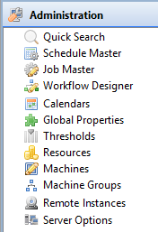

# Working with Administration

The **Administration** topic in the Navigation Panel provides the screen information and procedures for the [editors](Navigation-Editors.md) and
[views](Navigation-Views.md).

:::note
For you to perform any functions, you must have all of the appropriate privileges. For additional information, refer to [Departmental Function Privileges](../../../administration/privileges.md#departmental-function-privileges) in the **Concepts** online help.
:::

Click on any **Administration** [function item[[]{.MCTextPopupArrow}Fuction items are displayed as icons with
descriptions in the Navigation Panel.]{.MCTextPopupBody
.MCTextPopupBody_Closed .needs-pie .popupBody
aria-hidden="true"}](javascript:void(0)){.MCTextPopup .popup .popupHead}
in the graphic to learn more about that item.

:::
