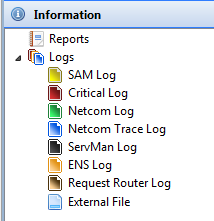

# Working with Enterprise Information

The [Information]{._Override style="font-weight: bold; font-style: normal;"} topic in the [Navigation
Panel]{.GeneralNavigation} provides the views to manage the Reports and
Log file information.

Click on any **Information** [function item[[]{.MCTextPopupArrow}Fuction items are displayed as icons with descriptions in the Navigation
Panel.]{.MCTextPopupBody .MCTextPopupBody_Closed .needs-pie .popupBody
aria-hidden="true"}](javascript:void(0)){.MCTextPopup .popup .popupHead}
in the graphic to learn more about that item.

:::
