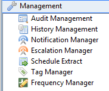

# Working with Management {#working-with-management style="margin-bottom: 6pt;"}

The **Management** topic in the Navigation Panel provides the views to manage the Audit Management, History Management,
and Notification Manager information.

Click on any **Management** [function item[[]{.MCTextPopupArrow}Fuction items are displayed as icons with descriptions in the Navigation
Panel.]{.MCTextPopupBody .MCTextPopupBody_Closed .needs-pie .popupBody
aria-hidden="true"}](javascript:void(0)){.MCTextPopup .popup .popupHead}
in the graphic to learn more about that item.

:::
