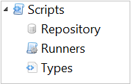

# Working with Scripts

The **Scripts** topic in the Navigation Panel provides the views to manage the script repository, script runners, and
script types.

Click on any **Administration** [function item[[]{.MCTextPopupArrow}Fuction items are displayed as icons with
descriptions in the Navigation Panel.]{.MCTextPopupBody
.MCTextPopupBody_Closed .needs-pie .popupBody
aria-hidden="true"}](javascript:void(0)){.MCTextPopup .popup .popupHead}
in the graphic to learn more about that item.

:::
