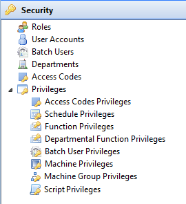

# []{#top}Working with Security

The **Security** topic in the [Navigation Panel]{.GeneralNavigation} provides the views to manage the User Accounts and User Privileges
information.

Click on any **Administration** [function item[[]{.MCTextPopupArrow}Fuction items are displayed as icons with
descriptions in the Navigation Panel.]{.MCTextPopupBody
.MCTextPopupBody_Closed .needs-pie .popupBody
aria-hidden="true"}](javascript:void(0)){.MCTextPopup .popup .popupHead}
in the graphic to learn more about that item.

:::
