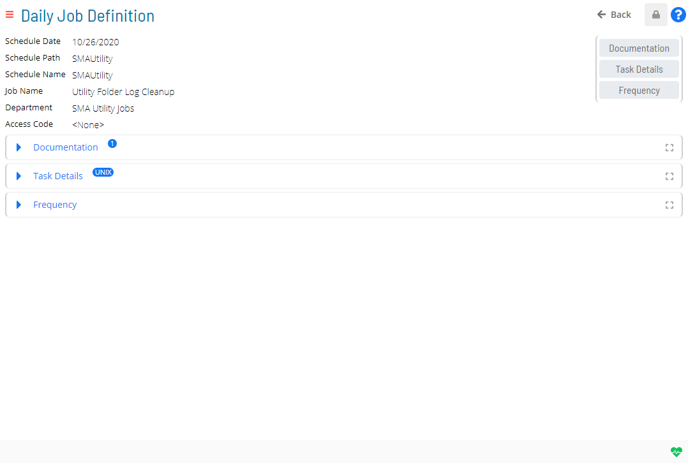
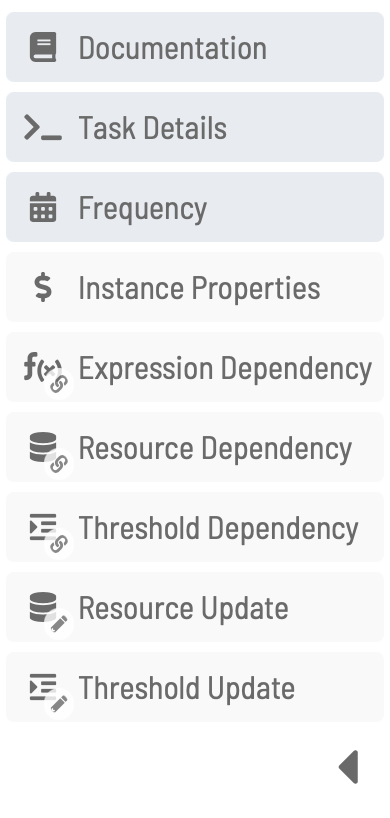

# Accessing Daily Job Definition

As part of the **Operations** module, those with the appropriate
privileges can view the daily job definition as well as modify job
properties. To make this possible, **Daily Job Definition** has the
following two modes:

- **Read-only**: In this mode, you can review the defined properties
    for the selected job. Job properties cannot be edited while in this
    mode.
- **Admin**: In this mode, you can modify the properties, which
    includes reconfiguring platform-specific details, for the selected
    job.

## Required Privileges

In order to view the daily job definition, you must have [at least]{.ul} all of the following privileges:

- **Schedule Privilege**: User must be at least in a role that has
    access to the job's parent schedule.
- **Departmental Function Privilege**: User must be at least in a role
    that has View Jobs in Daily Schedules and View Jobs in Schedule
    Operations privileges for the assigned job's department.
- **Access Code Privilege**: User must be at least in a role that has
    access to the assigned job access code.

In order to edit the daily job definition, you must be in the ocadm role
or have [at least]{.ul} all of the following privileges:

- **Schedule Privilege**: User must be at least in a role that has
    access to the job's parent schedule.
- **Departmental Function Privilege**: User must be at least in a role
    that has View Jobs in Daily Schedules, View Jobs in Schedule
    Operations, Modify Jobs in Daily Schedules privileges for the
    assigned job's department.
- **Access Code Privilege**: User must be at least in a role that has
    access to the assigned job access code with **Allow job updates**
    flag set to true.

## Daily Job Definition Access

To access the daily job definition:

1. Click on the **Processes** button at the top-right of the
    **Operations Summary** page. The **Processes** page will display.
2. Ensure that both the **Date** and **Schedule** toggle switches are
    enabled so that you can make your date and schedule selection,
    respectively. Each switch will appear green when enabled.
3. Select the desired **date(s)** to display the associated
    schedule(s).
4. Select one or more **schedule(s)** in the list.
5. Select one **job** in the list. A record of your selection will
    display in the [status bar](SM-UI-Layout.md#Status) at the
    bottom of the page in the form of a breadcrumb trail.
6. Click on the job record (e.g., 1 job(s)) in the status bar to
    display the **Selection** panel.
7. Click the **Daily Job Definition** button 
    at the top-left corner of the panel to access the **Daily Job
    Definition** page. By default, this page will be in **Read-only**
    mode. Refer to the next section to learn more about the properties
    on the **Daily Job Definition** page.
8. Click the **Cancel** button to return to the previous page.
9. Close the **Selection** panel when done.

:::note
Daily Job Definition can also be accessed while in PERT View. For more information, refer to [PERT View Daily Job Definition Access](Using-PERT-View.md#PERT10).
:::

## Daily Job Definition Properties

**Daily Job Definition** contains general information about the job as
well as panels that expose the defined properties when expanded. For
those with the appropriate privileges, a **Lock** button will also
appear at the top-right corner of the page that allows you to switch
between the two modes. The button appears gray and locked ()
when in **Read-only** mode and appears green and unlocked ()
when in **Admin** mode. The page also has a [menu](#Daily3) for quickly
accessing the panels.

Daily Job Definition in Solution Manager

### General Info

For information about the **General Info** section, refer to [Viewing and Updating General Info](Viewing-and-Updating-General-Info.md).

### Daily Job Definition Panels

Each expandable panel that is displayed on the **Daily Job Definition**
page represents a job property category.

- In **Read-only** mode, a panel is displayed only when properties
    have been defined for the category. These properties can be viewed
    only and not changed while in this mode.
- In **Admin** mode, all available panels are displayed on the page
    and may contain properties that can be modified.

Click on any of the following quick links to learn more about each of
the panels available for the daily job definition:

- [Documentation](Viewing-and-Updating-Documentation.md)
- [Task Details](Viewing-and-Updating-Job-Task-Details.md)
- [Frequency](Viewing-and-Updating-Job-Frequencies.md)
- [Instance     Properties](Viewing-and-Updating-Instance-Properties.md)
- [Expression     Dependency](Viewing-and-Updating-Expression-Dependencies.md)
- [Resource     Dependency](Viewing-and-Updating-Resource-Dependencies.md)
- [Threshold     Dependency](Viewing-and-Updating-Threshold-Dependencies.md)
- [Resource Update](Viewing-and-Updating-Resource-Updates.md)
- [Threshold     Update](Viewing-and-Updating-Threshold-Updates.md)

### Daily Job Definition Menu

The menu in the left portion of the page allows you to access any of the
daily job definition panels quickly. The menu can be collapsed to show
icons and tool tips only. When a menu item is left clicked, the view
automatically scrolls to that particular panel on the page and the panel
is expanded to expose its contents. Right clicking a menu item will
toggle **Full Screen** mode.

.png "More Info icon")
Related Topics

- [Accessing Job Summary](Accessing-Job-Summary.md)
- [Using PERT View](Using-PERT-View.md)
- [Viewing and Updating General     Info](Viewing-and-Updating-General-Info.md)
- [Viewing and Updating     Documentation](Viewing-and-Updating-Documentation.md)

- [Viewing and Updating Instance     Properties](Viewing-and-Updating-Instance-Properties.md)

- [Viewing and Updating Job Task     Details](Viewing-and-Updating-Job-Task-Details.md)

- [Viewing and Updating Job     Frequencies](Viewing-and-Updating-Job-Frequencies.md)

- [Viewing and Updating Expression     Dependencies](Viewing-and-Updating-Expression-Dependencies.md)

- [Viewing and Updating Resource     Dependencies](Viewing-and-Updating-Resource-Dependencies.md)

- [Viewing and Updating Threshold     Dependencies](Viewing-and-Updating-Threshold-Dependencies.md)

- [Viewing and Updating Resource     Updates](Viewing-and-Updating-Resource-Updates.md)

- [Viewing and Updating Threshold     Updates](Viewing-and-Updating-Threshold-Updates.md)

:::
