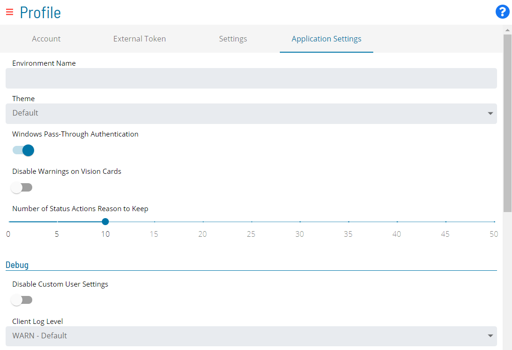
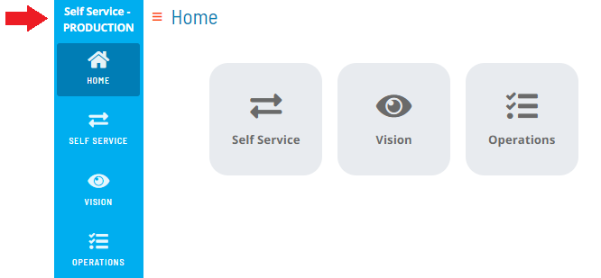
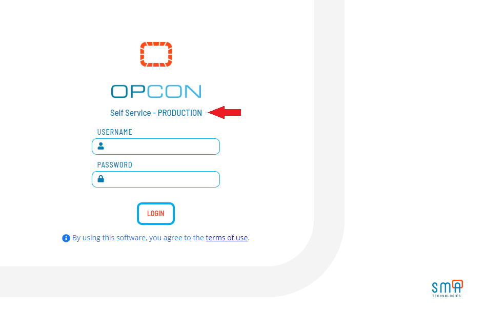

# Configuring Application Settings

  -------------------------------------------------------------------------------------------------------------------------------- ---------------------------------------------------------------------------------------------------------------------
  .png "Note icon")   **NOTE:** [The **Application Settings** tab will be available only to users who are in the ocadm role.]
  -------------------------------------------------------------------------------------------------------------------------------- ---------------------------------------------------------------------------------------------------------------------

To configure application settings:

Log into the Solution Manager, if not already logged in.

Click on the **user profile** button located in the **Navigation** menu,
as shown in the graphic.

The **Profile** page will display.

Select the **Application Settings** tab on the **Profile** page, as
shown in the graphic.

Configure any of the following settings:

- [Environment Names](#Environm)
- [Themes](#Themes)
- [Windows Pass-Through Authentication](#Windows)
- [Vision Card Warnings](#Vision)
- [Status Actions Reason Caching](#Status)
- [Debug](#Debug)

Click [Save]{._Override style="font-weight: bold;"} to save the changes to the database.

## Environment Names

Environment names allow you to label your OpCon environments so that you
can easily identity the environments in which you are working. Once
defined, the environment name will appear at the top of the [Navigation menu](SM-UI-Layout.md#Navigati) in the application and will also
appear on the [login screen](Logging-In.md#Solution_Manager_Login_Screen).

Environment Name Displayed in Application

  -------------------------------------------------------------------------------------------------------------------------- ---------------------------------------------------------------------------------------------------------------------------
      
  -------------------------------------------------------------------------------------------------------------------------- ---------------------------------------------------------------------------------------------------------------------------

## Themes

Themes allow you to customize the look and feel (skin) of each of your
OpCon environments in order to distinguish them. You can select one of
the following predefined themes for your environment:

- {.flat
    width="25px"} Default
- {.flat
    width="25px"} Blueberry
- {.flat
    width="25px"} Melon
- {.flat
    width="25px"} Emerald
- {.flat
    width="25px"} Ruby

## Windows Pass-Through Authentication

This switch allows you to enable/disable Windows Authentication.

## Vision Card Warnings

You can set whether or not you want a Vision card to change status
(display in a Warning state) if there are jobs in the
[Cancelled]{.skd-job-statuses}, [Skipped]{.skd-job-statuses}, or [Missed Start Time]{.skd-job-statuses} status. You can use this switch to
disable the Warning state on Vision cards. If you disable the Warning
state, then these jobs will be considered finished (and without error or
warning).

## Status Actions Reason Caching

You can set the number of Status Reasons that are cached and populated
in the **Change Status Reason** drop-down list for Job or Schedule
status updates. For example, if you set this option to 10, then the
**Change Status Reason** drop-down list will store the last ten (10)
reasons entered for Job or Schedule status updates.

## Debug

The **Debug** section allows you to configure the global debugging in
the application. You can configure the following debugging options:

- **Disable Custom User Settings**: This switch allows you to set
    whether or not users will be permitted to define custom debug
    settings. If disabled, debug options will not be displayed to users.
- **Client Log Level**: This option allows you to write logs to your
    web browser console. Since client logs are local, they will be lost
    once the browser is closed.
- **Deep Observe**: This option enables a Framework event observe.
- **Send Trigger**: This option allows you to set the trigger for
    sending server logs to the API server to be saved in files. There
    are three options:
  - **Disabled**: This option disables the trigger.
  - **Send on Interval and Max Size**: This option allows you to set
        an interval- or size-driven trigger with these settings:
    - **Log Level**: This option allows you to set the server log
            level.
    - **Api**: This option, when enabled, logs all the
            communications (requests and responses) between the Client
            and Server.
    - **Interval (s)**: This option allows you to configure the
            logs to be sent at a certain time interval (from 0 to 600
            seconds).
    - **Max Size (characters)**: This option allows you to
            configure the logs to be sent on the accumulated max
            character size limit (from 0 to 5000 kilobytes).
  - **Send on Event**: This option allows you to set an event-driven
        trigger with these settings:
    - **Log Level**: This option allows you to set the server log
            level.
    - **Api**: This option, when enabled, logs all the
            communications (requests and responses) between the Client
            and Server.
    - **Trigger Log Level**: This option allows you to configure
            the logs to be sent when an ERROR or WARN occurs.
    - **Max Size to keep (characters)**: This options allows you
            to configure the logs to be sent on the max size to keep
            limit (from 0 to 5000 kilobytes).

  -------------------------------------------------------------------------------------------------------------------------------- -----------------------------------------------------------------------------------------------------------------------------------------------------------------------------------------------------------------------------------------------------------------------------------------------------------------------------------------------------------
  .png "Note icon")   **NOTE:** [In instances where you are able to reproduce an issue in the application, you can also utilize the **InstantLog Mode** feature to generate a temporary log file to send to the Support team. For more information about how to activate this feature, refer to [InstantLog Mode](SM-UI-Layout.md#InstantLog).]
  -------------------------------------------------------------------------------------------------------------------------------- -----------------------------------------------------------------------------------------------------------------------------------------------------------------------------------------------------------------------------------------------------------------------------------------------------------------------------------------------------------
:::
