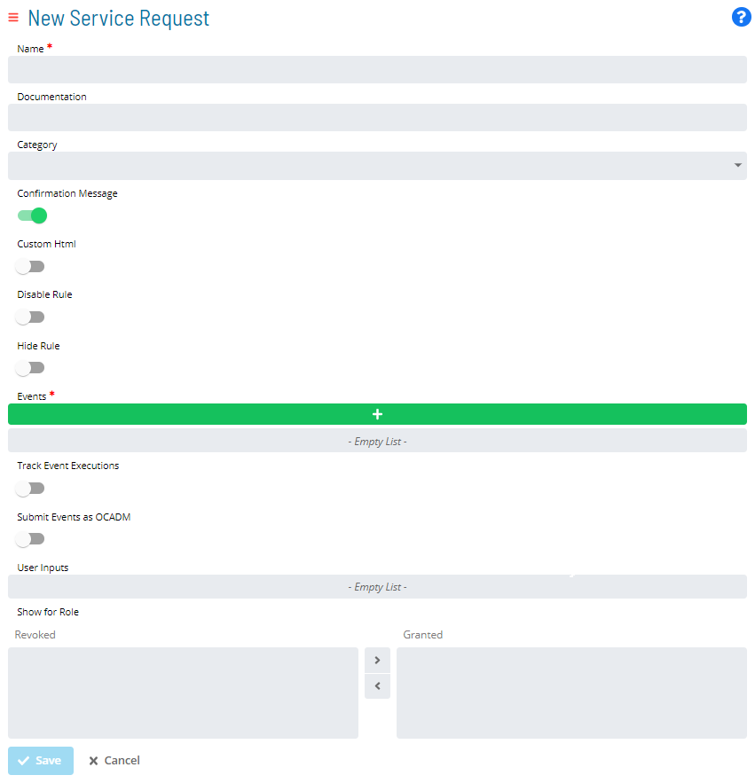

#  Creating Service Requests

To create a new service request and its definition:

Click the **Create** button.

 

The **New Service Request** page will display, as shown in the example
graphic.

Enter in the **Name** field the *Service Request Name* to specify the
name to display on the Service Request button.

*(Optional)* Enter in the **Documentation** field the
*instructions* about what the Service Request does when users click the
button. This text appears as a tooltip on the button.

*(Optional)* Select a **Category** with which to
associate the Service Request. Refer to the [Creating Categories](Creating-Categories.md) section for instructions on how
to create categories.

*(Optional)* Toggle the **Confirmation Message** switch
to show the «Documentation» as part of confirmation page when users
click the Service Request button. This allows users to cancel the
request.

*(Optional)* Toggle the **Custom Html** switch to embed
custom HTML code to personalize the Service Request button
display. Refer to the [Stylizing Service Request Buttons](Stylizing-Service-Requests.md#_Setting_Up_OpCon) section
for more detail.

*(Optional)* Toggle the **Disable Rule** switch to
define a rule for disabling the Service Request button. Refer to the
[Disabling or Hiding Service Request Buttons](Disabling_Hiding-Service-Requests.md) section for
instructions on how to define rules.

*(Optional)* Toggle the **Hide Rule** switch to define a
rule for hiding the Service Request button. Refer to the [Disabling or Hiding Service Request
Buttons](Disabling_Hiding-Service-Requests.md) section for
instructions on how to define rules.

Click the green add button in the **Events** frame to manage the
OpCon Events that will be sent to
OpCon when users click this Service Request
button. Refer to the [[Setting up OpCon Events]{.Hyperlink}](Setting-up-OpCon-Events.md#_Setting_Up_OpCon)
section for more detail.

*(Optional)* Toggle the **Track Event Executions**
switch to monitor execution on any job dynamically added as part of the
Service Request. If the Service Request is defined with any $JOB:ADD
events, this option will track the added jobs so that users can see if
they finished successfully.

-   If you select this option, the Service Request will be completed
    only when all added jobs are finished. If a job fails, then the
    Service Request will fail as well.

*(Optional)* Toggle the **Submit Events as OCADM**
switch if you are in the ocadm role to send
OpCon Events using «ocadm».

-   If you select this option, events will always proceed without any
    privilege issues. 
-   If you do not select this option, SAM will check the privileges for
    the OpCon user who clicks the button
    before processing the events.

*(Optional)* Use the **User Inputs** field, as needed.
If you define variables in the OpCon Events,
they are automatically picked up and used as User Inputs. These User
Input fields are displayed when users click the button for the Service
Request. This provides a way for users to provide values that are going
to replace the variables in the OpCon Events.
Refer to the [[Setting up User Inputs]{.Hyperlink}](Setting-up-User-Inputs.md#_Setting_Up_User)
section for more detail.

Use the **Show for Role** option to assign the Service Request to one or
more OpCon Roles. Only users under the
granted Role(s) will be able to see and trigger the Service Request.
Refer to the [[Setting up Privileges]{.Hyperlink}](Setting-up-Privileges.md#_Setting_Up_Privileges)
section for more detail.

Click **Save**. The new Service Request should now display.
:::

 

