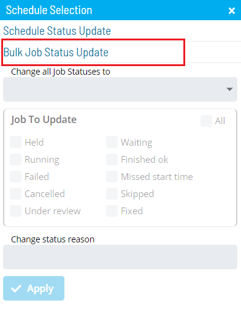

# Performing Bulk Job Status Updates (Schedule Level)

The **Operations** module has made performing mass action on job status
updates at the schedule level easier. Let's say, for example, that you
wanted to specify the following mass update conditions:

1. Update the job's status to [Cancel]{.skd-job-statuses} for the     selected schedule when the job's current state is
    [Waiting]{.skd-job-statuses}. 2.  Update the job's status to [Cancel]{.skd-job-statuses} for the
    selected schedule when the job's current state is in [Waiting,     Held]{.skd-job-statuses}.

This is all possible in **Operations** with a few simple steps.

To perform bulk job status updates:

Click on one of the five operation dials (Failed, Blocked, Waiting,
Running, or Completed) or use the **Quick Search** field (type the
keyword and click **Enter**) in the **Schedules** section on the
**Operations Summary** page.


The **Processes** page will display.

Ensure that both the **Date** and **Schedule** toggle switches are
enabled so that you can make your date and schedule selections,
respectively. Each switch will appear green when enabled.


Select the desired **date(s)** and **schedule(s)** in each respective
list. A record of your selection(s) will display in the [status bar](SM-UI-Layout.md#Status) at the bottom of the page in the form
of a breadcrumb trail.


+----------------------------------+----------------------------------+
| .png "Note icon") | filter and/or sort the list of   |
|                                  | schedules to make it easier to   |
|                                  | make your schedule               |
|                                  | selections.]         |
|                                  |                                  |
|                                  | -   [For filtering, use the      | |                                  |     **Filter Bar** just above    |
|                                  |     the list of schedules to     |
|                                  |     filter the list. Type the    |
|                                  |     keyword in the appropriate   |
|                                  |     field and click **Enter**,   |
|                                  |     and the list will filter     |
|                                  |     accordingly.]    |
|                                  |                                  |
|                                  | ```{=html}                       |
|                                  | <!-- -->                         |
|                                  |```                              |
|                                  | -   [For sorting, click on the   | |                                  |     column heading to sort the   |
|                                  |     column in ascending order    |
|                                  |     (indicated by a small arrow  |
|                                  |     pointing down). Click on the |
|                                  |     column heading again to sort |
|                                  |     the column in descending     |
|                                  |     order (indicated by a small  |
|                                  |     arrow pointing up).          |
|                                  |     ]                |
+----------------------------------+----------------------------------+

Click on the schedule record (e.g., 3 schedule(s)) in the status bar to
display the **Selection** panel.

:::note
As an alternative, you can right-click on any schedule selected in the list to display the **Selection** panel.
:::

Select the **Bulk Job Status Update** accordion-style tab in the panel.



Select one of the following options in the **Change all Job Statuses
to** drop-down list:

- **Cancel**: This option allows you to cancel all jobs for the
    selected schedule(s), based on a filter. Any jobs dependent on
    cancelled jobs do not have those dependencies met.
- **Hold**: This option allows you to suspend the processing of ALL
    jobs associated with the selected schedule(s), based on a filter.
- **Mark Failed**: This option allows you to mark all jobs on the
    selected schedule(s) as [Failed]{.skd-job-statuses}, based on a     filter.
- **Mark Finished OK**: This option allows you to mark all jobs on the
    selected schedule(s) as [Finished OK]{.skd-job-statuses}, based on a     filter.
- **Mark Under Review**: This option allows you to mark all jobs on
    the selected schedule(s) as [Under Review]{.skd-job-statuses}, based     on a filter.
- **Mark Fixed**: This option allows you to mark all jobs on the
    selected schedule(s) as [Fixed]{.skd-job-statuses}, based on a     filter.
- **Release**: This option allows you to place all held jobs on the
    selected schedule(s) back into a [Qualifying]{.skd-job-statuses}     state, based on a filter. Jobs start as soon as all dependencies are
    met.
- **Restart**: This option allows you to place all jobs on the
    selected schedule(s) back in a [Qualifying]{.skd-job-statuses}     state, based on a filter. Jobs are started as soon as all
    dependencies are met.
- **Restart on Hold**: This option allows you to place all jobs on the
    selected schedule(s) in an On Hold state on     restart, based on a filter.
- **Skip**: This option allows you to place all jobs on the selected
    schedule(s) in a [Job to be Skipped]{.skd-job-statuses} state until     they qualify to start. When the jobs qualify, the jobs are skipped
    and the job dependencies of all subsequent jobs will be met.

:::note
For more information about job status changes, refer to [Schedule and Job Status Change Commands](../../../operations/status-change-commands.md) in the **Concepts** online help.
:::

Select the **checkbox(es)** for the current job status(es) that will
undergo the status change. Any selection made in the **Jobs To Update**
frame will serve as a status filter.

:::note
For more information about job statuses and allowed changes, refer to [Schedule and Job Status Descriptions and Allowed Status Changes](../../../operations/status-descriptions.md) in the **Concepts** online help.
:::

*(Optional)* Enter or select a change status reason.

:::note
Depending on application configuration, the **Change Status Reason** drop-down list may store a number of the previous reasons entered for Job or Schedule status updates.
:::

Click **Apply** to apply the job status change.

Close the **Selection** panel when done.

.png "More Info icon")
Related Topics

- [Performing Schedule Status     Changes](Performing-Schedule-Status-Changes.md)
- [Performing Job Status     Changes](Performing-Job-Status-Changes.md)
- [Performing Agent Status     Updates](Performing-Agent-Status-Updates.md)
- [Viewing Job Output](Viewing-Job-Output.md)
- [Using PERT View](Using-PERT-View.md)
- [Managing Daily Processes](Managing-Daily-Processes.md)
