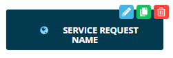

# Stylizing Service Request Buttons

You can also stylize the Service Request button using custom HTML.

To customize the button:

Click the **Edit** button at the top-right corner of the Service Request
button. The **Edit Service Request** page displays.

Toggle the **Custom Html** switch on. A text field displays for entering
the custom HTML code.

Enter the following template HTML code:

::: {style="background-color: #dcdcdc;"}
\

    \&\#xf0ac\</span\>

    \<span\>SERVICE REQUEST NAME\</span\>

\</div\>
:::

Modify the code, as needed. Below are a few recommendations for updating
the icon and text on the button.

To modify the font icon that appears on the button:

Change the color of the font icon by entering a new HEX color code in
the template code, as highlighted below in orange:

::: {style="background-color: #dcdcdc;"}
\&\#xf0ac\</span\> :::

Change the appearance of the font icon by entering or pasting a new
Unicode in the template code, as highlighted below in orange:

::: {style="background-color: #dcdcdc;"}
\&\#x[f0ac]{style="background-color: #ff8c00;"}\</span\> :::

To find the desired Unicode:

a.  Go to: <https://fontawesome.com/v4.7.0/icons/>.
b.  Select the icon that you wish to include on the button.
c.  Copy the Unicode from the icon\'s details page, as shown in the
    graphic.

Remove the font icon from the button by commenting out the following
line in the template code, as demonstrated below:

::: {style="background-color: #dcdcdc;"}
\<!\--\&\#xf0ac\</span\>\--\>
:::

To modify the text that appears on the button:

Change the [\<span\>]{style="font-family: 'Courier New';"} text in the template code to match the actual Service Request Name, as highlighted
below in orange:

::: {style="background-color: #dcdcdc;"}
\<span\>[SERVICE REQUEST NAME]{style="background-color: #ff8c00;"}\</span\>
:::

  -------------------------------------------------------------------------------------------------------------------------------- ---------------------------------------------------------------------------------------------------------------------------------------------------------------------------------------------------------------------------------------------------------------------------------------------------------------------------------------------------------------------------------------------------------------------------------
  .png "Note icon")   **NOTE:** [If you submit a [Service Request using a URL]{.Hyperlink}, the URL uses the Service Request Name and not the text displayed by the custom HTML. To avoid confusion, it is recommended that you copy the Service Request Name into the custom HTML [\<span\>]{style="font-family: 'Courier New';"} text area. This way, the actual Service Request Name and the text displayed on the button will match.]
  -------------------------------------------------------------------------------------------------------------------------------- ---------------------------------------------------------------------------------------------------------------------------------------------------------------------------------------------------------------------------------------------------------------------------------------------------------------------------------------------------------------------------------------------------------------------------------

The result using the template code:

:::
