# Using PERT View

PERT functionality renders on-demand diagrams that show job dependency
relationships. These visualizations can be accessed from the
**Processes** page in the **Operations** module.

PERT View in Solution Manager

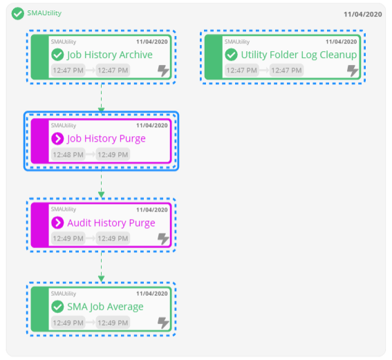

## PERT View Tips

Here are things to keep in mind when using PERT View in Solution
Manager:

Use the **Refresh** button to refresh the data and update the PERT
representation.

Use the **Auto-refresh** toggle switch to control auto-refreshing of the
PERT diagram. When enabled, any structural changes to the diagram are
detected and the view is automatically refreshed (if not manually
refreshed by users).

Simultaneously press the **Ctrl** key and scroll the mouse wheel up or
down for zooming capability on the diagram.

A dashed royal blue border will appear around nodes in the diagram to
indicate what was originally selected (i.e., jobs or schedules) for
visualization.

The color of each node in the diagram is dependent upon the underlying
job's current job status, as indicated below:

- Green - Indicates the underlying job has a status of [Finished     OK]{.skd-job-statuses}.
- Black - Indicates the underlying job has a status of
    [Cancelled]{.skd-job-statuses}. -   Magenta - Indicates the underlying job has a status of
    [Skipped]{.skd-job-statuses}. -   Orange - Indicates the underlying job has a status of [Missed Start
    Time]{.skd-job-statuses}.
- Red - Indicates the underlying job has a status of
    Failed. -   Gray - Indicates the underlying job has a status of
    [Qualifying]{.skd-job-statuses}. -   Turquoise - Indicates the underlying job has a status of
    [Held]{.skd-job-statuses}.
Tooltips are available for Status and Alert icons within nodes in the
diagram.

Hovering over a node in a diagram will display a tooltip with black
background that includes any documentation relating to the job and
frequency of the selected job (as shown in the graphic) in the bottom
portion of the tip. Only the first eighty (80) characters of the
documentation will be displayed. If no documentation is available, the
bottom portion will appear empty, as indicated by the dash (-)
character.

Nodes that represent Container jobs are stylistically different from
other nodes in the layout (as shown in the graphic). When hovered on a
Container job, the cursor appears as a hand to indicate drill-down
capability to view any associated subschedule(s). After drilling down
into subschedule information, click on any segment of the breadcrumb
(which will show the navigation path) at the top-left to navigate to
previous views.

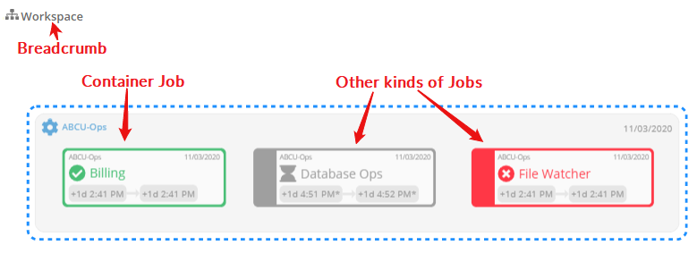

Enable the **Include Thresholds/Resources** switch ()
to display threshold and resource dependencies in the PERT diagram, as
shown in the graphic. When hovered on the dependency line, the required
value of the dependency is displayed as a tooltip.

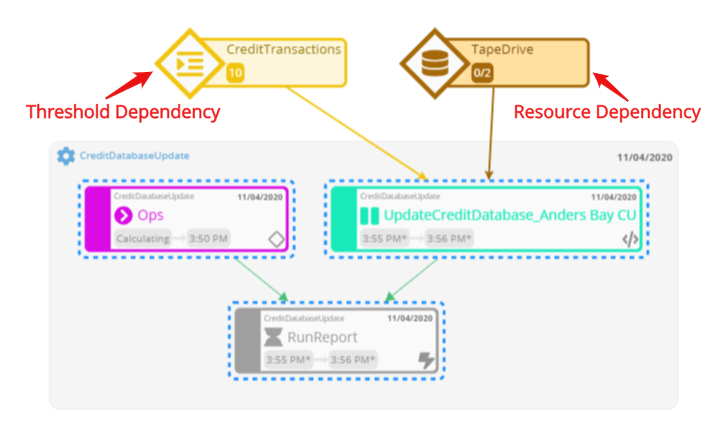

- When hovered over a resource dependency line, the tooltip displays
    the number of resources the job requires.
- When hovered over a threshold dependency line, the tooltip displays
    the numeric value for the threshold. This value will contain one of
    the following valid operators: equal (=), greater than (\>), less
    than (\<), greater than or equal to (≥), less than or equal to (≤),
    not equal (≠).

Within nodes, these icons represent the following:

- {.flat
    width="25px"} - Indicates that there are threshold/resource updates
    associated with underlying Daily jobs. When hovered over the icon,
    the associated update is displayed as a tooltip.
- {.flat
    width="25px"} - Indicates that there are OpCon Events associated
    with underlying Daily jobs. When hovered over the icon, the
    associated event is displayed as a tooltip.
- {.flat
    width="23px"} - Indicates that there are expression dependencies
    associated with underlying Daily jobs. When hovered over the icon,
    the associated expression dependency is displayed as a tooltip.
- {.flat
    width="20px"} - Indicates that there is a required dependency
    missing. When hovered over the icon, the number of required
    dependencies missing is displayed as a tooltip.

If the diagram is extremely complex (e.g., has many jobs or nodes or
dependencies), the representation will be rendered with a simplistic
layout.

## PERT View Access

To access PERT View:

Click on the **Processes** button at the top-right of the **Operations
Summary** page. The **Processes** page will display.

Ensure that both the **Date** and **Schedule** toggle switches are
enabled so that you can make your date and schedule selections,
respectively. Each switch will appear with a green checkmark when
enabled.

Select the desired **date(s)** to display the associated schedule(s).

Select one or more **schedule(s)** or **job(s)** in the perspective
list.

Right-click on the selected schedule(s) or selected job(s) to display
the **Selection** panel.

Select the **Diagram** accordion-style tab in the panel.

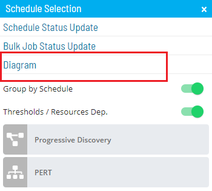

Enable the **Group by Schedule** switch ()
to group or organize the workflow by schedule. If **Group by Schedule**
is disabled, the jobs will be integrated in the diagram.

- Enabling the **Group by Schedule** switch also displays a **Schedule
    Status** indicator and tooltip near the schedule name at the
    top-left-corner of the PERT diagram in order to provide you with
    enough information to take appropriate actions at any given time.

Select one of the following options depending on the schedule/job
selections:

**PERT**: This option displays the individual jobs and job dependency
relationships for a schedule.

:::note
The PERT action will display all jobs and job dependency relationships for the selected schedule(s) whereas the Dependency Chain, Predecessors, or Successors action on the job(s) will display only the jobs related to the original selection.
:::

:::note
When PERT is requested for a schedule, the cross-schedule dependencies will also be displayed in the diagram. If the **Group by Schedule** option is enabled, then only the predecessor jobs from other schedules will be displayed in the workflow.
:::

**Isolate Dependency Chain**: This option displays the entire dependency
chain (e.g., is preceding the critical path and subsequent jobs).

**Isolate Predecessors**: This option displays all preceding jobs in a
dependent chain.

**Isolate Successors**: This option displays all subsequent jobs in a
dependent chain.

**Progressive Discovery**: This option displays a more focused view of
dependency relationships for real-time impact analysis by quickly
drawing the direct relationships of a selection, which performs better
than requesting complete dependency graphs on large and complex
workflows. Essentially, Progressive Discovery is an option on job and
schedule selections that first loads the current selection and shows the
direct (level 1) predecessor and successor jobs for the given selection.
In Progressive Discovery mode, the diagram shows cloud shapes (as shown
in the graphic) to highlight that the displayed job has
predecessor/successor trees on the next level. Click on a cloud shape in
the diagram to expand on the preferred level then iteratively expand and
discover more levels. Progressive Discovery will also display the
cross-schedule dependency as part of the possible predecessor- and
successor-level trees.

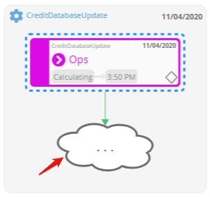

- Selecting then right-clicking on a threshold dependency in the PERT
    diagram while in Progressive Discovery mode will display the
    **Selection** panel. Once the panel is displayed, you have the
    option to look up and dynamically add dependent jobs (jobs that
    depend on the threshold) or update jobs (jobs that update the
    threshold). Depending on your selection, an array of job nodes will
    display in the panel. These can then be sorted by name, date, or
    schedule path. To add jobs in the panel to the diagram, simply click
    on the left arrow next to the job or click on the job. The job will
    be added to the diagram and associated with the threshold. Note that
    if a job has already been added to the diagram, it will appear
    grayed out in the panel and cannot be selected.
- Selecting then right-clicking on a resource dependency in the PERT
    diagram while in Progressive Discovery mode will display the
    **Selection** panel. Once the panel is displayed, you have the
    option to look up and dynamically add dependent jobs (jobs that
    depend on the resource) or update jobs (jobs that update the
    resource). Depending on your selection, an array of job nodes will
    display in the panel. While both dependent and update jobs in the
    panel can be sorted by name, date, or schedule path, dependent jobs
    can also be filtered to display only the jobs that currently use
    that resource (as well as all jobs that are dependent upon but have
    not yet used the resource). To add jobs in the panel to the diagram,
    simply click on the left arrow next to the job or click on the job.
    The job will be added to the diagram and associated with the
    resource. Note that if a job has already been added to the diagram,
    it will appear grayed out in the panel and cannot be selected.

Select the **Export** button to save the current view (i.e., what is
currently displayed on the screen) locally to your machine as a PNG
file.

:::note
To export the entire PERT representation, ensure that everything is captured on screen by using the zooming options.
:::

## PERT View Dependency Lines

In PERT View, each dependency type is represented by a different line
style and image at the end.

+----------------------------------+----------------------------------+
|  | dependency.                      |
|                                  |                                  |
|                                  |                                  |
|                                  |                                  |
|                                  | For this dependency type, the    |
|                                  | following applies:               |
|                                  |                                  |
|                                  | -   The job on the end with the  |
|                                  |     arrow pointing towards it    |
|                                  |     (the selected job) has the   |
|                                  |     "Requires" dependency on   |
|                                  |     the job where the line       |
|                                  |     starts (the dependent job).  |
|                                  |     In other words, the          |
|                                  |     *dependent job* is the job   |
|                                  |     that the line begins and the |
|                                  |     *selected job* is the job to |
|                                  |     which the arrow points.      |
|                                  | -   The dependent job            |
|                                  |     [must]{.ul} exist in the     | |                                  |     Daily tables and [must]{.ul} |
|                                  |     fail after executing before  |
|                                  |     the selected job will run.   |
|                                  | -   If the dependent job is not  |
|                                  |     on a schedule in the Daily   |
|                                  |     tables, then the selected    |
|                                  |     job will not execute unless  |
|                                  |     it is overridden.            |
+----------------------------------+----------------------------------+
|  |                                  |
|                                  |                                  |
|                                  | For this dependency type, the    |
|                                  | following applies:               |
|                                  |                                  |
|                                  | -   The job on the end with the  |
|                                  |     arrow pointing towards it    |
|                                  |     (the selected job) has the   |
|                                  |     "Requires" dependency on   |
|                                  |     the job where the line       |
|                                  |     starts (the dependent job).  |
|                                  |     In other words, the          |
|                                  |     *dependent job* is the job   |
|                                  |     that the line begins and the |
|                                  |     *selected job* is the job to |
|                                  |     which the arrow points.      |
|                                  | -   The dependent job            |
|                                  |     [must]{.ul} exist in the     | |                                  |     Daily tables and [must]{.ul} |
|                                  |     complete successfully before |
|                                  |     the selected job will run.   |
|                                  | -   If the dependent job is not  |
|                                  |     on a schedule in the Daily   |
|                                  |     tables, then the selected    |
|                                  |     job will not execute unless  |
|                                  |     it is overridden.            |
+----------------------------------+----------------------------------+
|  |                                  |
|                                  |                                  |
|                                  | For this dependency type, the    |
|                                  | following applies:               |
|                                  |                                  |
|                                  | -   The job on the end with the  |
|                                  |     arrow pointing towards it    |
|                                  |     (the selected job) has the   |
|                                  |     "Requires" dependency on   |
|                                  |     the job where the line       |
|                                  |     starts (the dependent job).  |
|                                  |     In other words, the          |
|                                  |     *dependent job* is the job   |
|                                  |     that the line begins and the |
|                                  |     *selected job* is the job to |
|                                  |     which the arrow points.      |
|                                  | -   The dependent job            |
|                                  |     [must]{.ul} exist in the     | |                                  |     Daily tables. The selected   |
|                                  |     job will run when the        |
|                                  |     dependent job completes,     |
|                                  |     regardless of the exit       |
|                                  |     status.                      |
|                                  | -   If the dependent job is not  |
|                                  |     on a schedule in the Daily   |
|                                  |     tables, then the selected    |
|                                  |     job will not execute unless  |
|                                  |     it is overridden.            |
+----------------------------------+----------------------------------+
|  | dependency.                      |
|                                  |                                  |
|                                  |                                  |
|                                  |                                  |
|                                  | For this dependency type, the    |
|                                  | following applies:               |
|                                  |                                  |
|                                  | -   The job on the end with the  |
|                                  |     arrow pointing towards it    |
|                                  |     (selected job) has an        |
|                                  |     "After" dependency on the  |
|                                  |     job where the line starts    |
|                                  |     (dependent job). In other    |
|                                  |     words, the *dependent job*   |
|                                  |     is the job that the line     |
|                                  |     begins and the *selected     |
|                                  |     job* is the job to which the |
|                                  |     arrow points.                |
|                                  | -   If the dependent job is in   |
|                                  |     the Daily tables, then the   |
|                                  |     selected job waits until the |
|                                  |     dependent job fails to       |
|                                  |     complete successfully.       |
|                                  | -   If the dependent job is not  |
|                                  |     on a schedule in the Daily   |
|                                  |     tables, then the selected    |
|                                  |     job runs without waiting for |
|                                  |     that dependent job.          |
+----------------------------------+----------------------------------+
|  | Finished OK* dependency.         |
|                                  |                                  |
|                                  |                                  |
|                                  |                                  |
|                                  | For this dependency type, the    |
|                                  | following applies:               |
|                                  |                                  |
|                                  | -   The job on the end with the  |
|                                  |     arrow pointing towards it    |
|                                  |     (selected job) has an        |
|                                  |     "After" dependency on the  |
|                                  |     job where the line starts    |
|                                  |     (dependent job). In other    |
|                                  |     words, the *dependent job*   |
|                                  |     is the job that the line     |
|                                  |     begins and the *selected     |
|                                  |     job* is the job to which the |
|                                  |     arrow points.                |
|                                  | -   If the dependent job is in   |
|                                  |     the Daily tables, then the   |
|                                  |     selected job waits until the |
|                                  |     dependent job completes      |
|                                  |     successfully.                |
|                                  | -   If the dependent job is not  |
|                                  |     on a schedule in the Daily   |
|                                  |     tables, then the selected    |
|                                  |     job runs without waiting for |
|                                  |     that dependent job.          |
+----------------------------------+----------------------------------+
|  |                                  |
|                                  |                                  |
|                                  |                                  |
|                                  | For this dependency type, the    |
|                                  | following applies:               |
|                                  |                                  |
|                                  | -   The job on the end with the  |
|                                  |     arrow pointing towards it    |
|                                  |     (selected job) has an        |
|                                  |     "After" dependency on the  |
|                                  |     job where the line starts    |
|                                  |     (dependent job). In other    |
|                                  |     words, the *dependent job*   |
|                                  |     is the job that the line     |
|                                  |     begins and the *selected     |
|                                  |     job* is the job to which the |
|                                  |     arrow points.                |
|                                  | -   If the dependent job is in   |
|                                  |     the Daily tables, then the   |
|                                  |     selected job waits until the |
|                                  |     dependent job completes,     |
|                                  |     regardless of the exit       |
|                                  |     status.                      |
|                                  | -   If the dependent job is not  |
|                                  |     on a schedule in the Daily   |
|                                  |     tables, then the selected    |
|                                  |     job runs without waiting for |
|                                  |     that dependent job.          |
+----------------------------------+----------------------------------+
|  | -weight: bold; color: #fc8184;"} |
|                                  | indicates an *Excludes*          |
|                                  | dependency. The job on the end   |
|                                  | with the                         |
|                                  | [X]{style="font                  | |                                  | -weight: bold; color: #fc8184;"} |
|                                  | on it is excluded by the job     |
|                                  | where the line starts.           |
+----------------------------------+----------------------------------+
|  | dependency. The job on the end   |
|                                  | with the circle has a            |
|                                  | "Conflict" dependency with the |
|                                  | job where the line starts. The   |
|                                  | job with the circle on it will   |
|                                  | not run if the job at the        |
|                                  | beginning of the line (without   |
|                                  | the circle) is running.          |
+----------------------------------+----------------------------------+
|  | on the end with the arrow        |
|                                  | pointing towards it has a        |
|                                  | requirement for the resource     |
|                                  | where the line starts.           |
+----------------------------------+----------------------------------+
|  | dependency. The job on the end   |
|                                  | with the arrow pointing towards  |
|                                  | it has a dependency on the       |
|                                  | threshold where the line starts. |
+----------------------------------+----------------------------------+

## PERT View Search

The Search bar in the top-left corner of the page allows you to search
jobs in the PERT View. Any keyword(s) or pattern can be entered as
search criteria and the results are returned just below the search bar
with the matching keyword(s) highlighted. You can then click on any job
returned in the search results to navigate directly to that job in the
PERT diagram.

:::note
Wildcards are supported in the search criteria. Standard wildcard characters include the asterisk (\*) for any characters and the question mark (?) for a single character substitution.
:::

Search Feature in PERT View

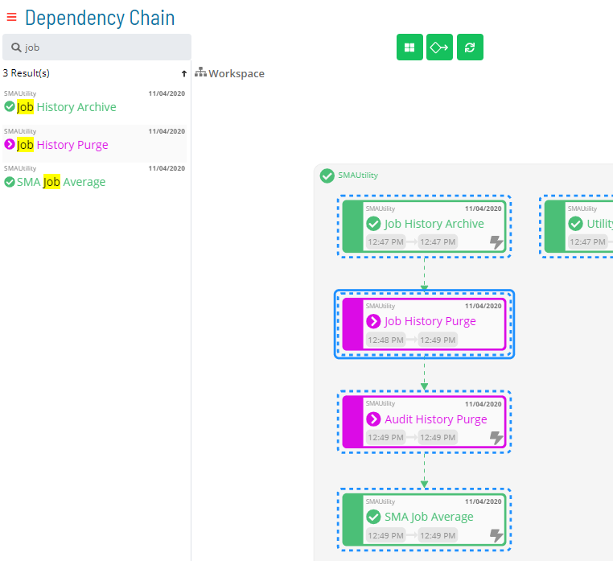

## PERT View Job Status Updates

In addition to performing job status changes in the **Processes** page,
job status updates can be performed within PERT View. You can either use
your mouse to select a single job or simultaneously press the **Ctrl**
key and your mouse to select several jobs in the PERT diagram. A solid
royal blue border appears around any selected job.

Once selected, right-click on the mouse to display the **Selection**
panel with the **Job Status Update** tab in focus, as shown in the
graphic. From there, follow [Steps 6 - 9]{.ul} of the [Performing Job
Status Changes](Performing-Job-Status-Changes.md) topic to change
the job status of the selected job(s) in the diagram.

Job Status Update in PERT View

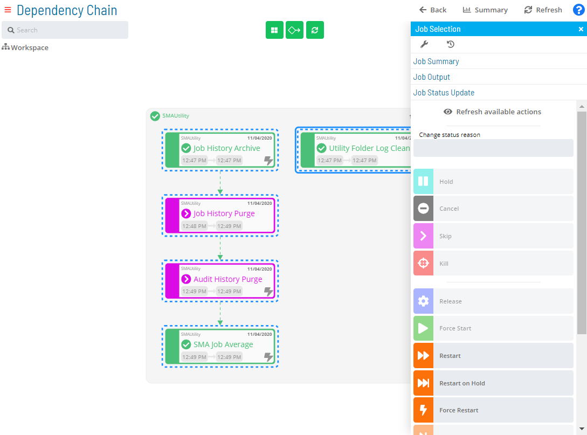

## PERT View Job Output Requests

As can be requested in the **Processes** page, job output files can be
retrieved in the PERT View for a job that is completed or has started,
is neither a NULL nor Container job, and does not have a status of
[Waiting]{.skd-job-statuses}, On Hold, [Cancelled]{.skd-job-statuses}, [Missed Start Time]{.skd-job-statuses},
or [Skipped]{.skd-job-statuses}.

In the PERT View, use your mouse to select a single job in the diagram
then right-click on the mouse to display the **Selection** panel. Keep
in mind that a solid royal blue border will appear around the selected
job. From there, select the **Job Output** accordion-style tab in the
panel, as shown in the graphic, then follow [Steps 5 - 9]{.ul} of the
[Viewing Job Output](Viewing-Job-Output.md) topic to request the
job output file(s).

Job Output in PERT View

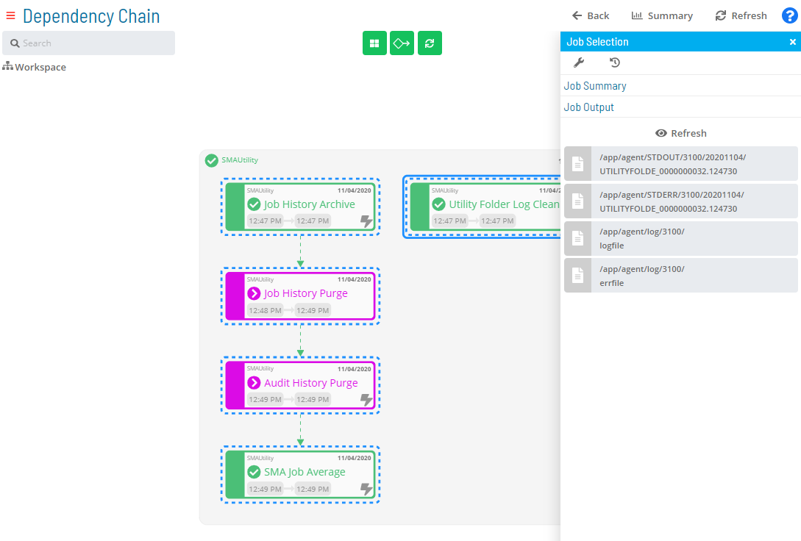

## PERT View Job Summary Access

In addition to being accessible from the **Processes** page, the Daily
job summary can also be viewed in the PERT View.

In the PERT View, use your mouse to select a single job in the diagram
then right-click on the mouse to display the **Selection** panel. Keep
in mind that a solid royal blue border will appear around the selected
job. From there, select the **Job Summary** accordion-style tab in the
panel, as shown in the graphic. For more information about the job
summary fields and options, refer to the [Accessing Job Summary](Accessing-Job-Summary.md) topic.

Job Summary Access in PERT View

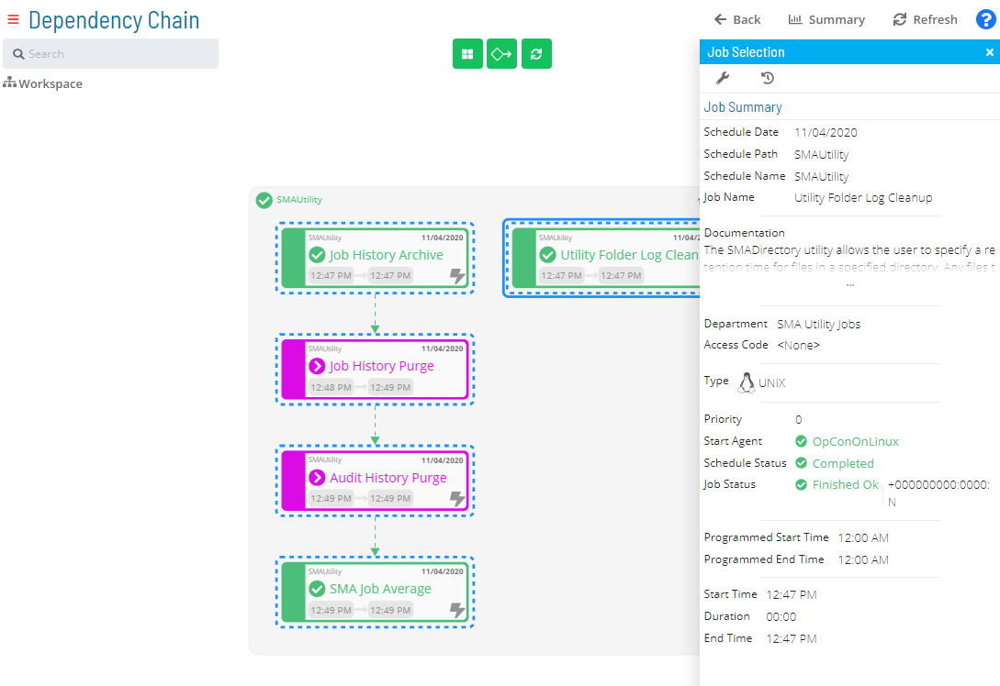

## PERT View Daily Job Definition Access

Job configuration can be accessed in the PERT View in addition to
accessing it from the **Processes** page.

In the PERT View, use your mouse to select a single job in the diagram
then right-click on the mouse to display the **Selection** panel. Keep
in mind that a solid royal blue border will appear around the selected
job. At the top-left corner of the panel, click the **Daily Job
Definition** button, as shown in the graphic. For more information about
how to reconfigure job properties, refer to the [Accessing Daily Job Definition](Accessing-Daily-Job-Definition.md)
topic.

Daily Job Definition Access in PERT View

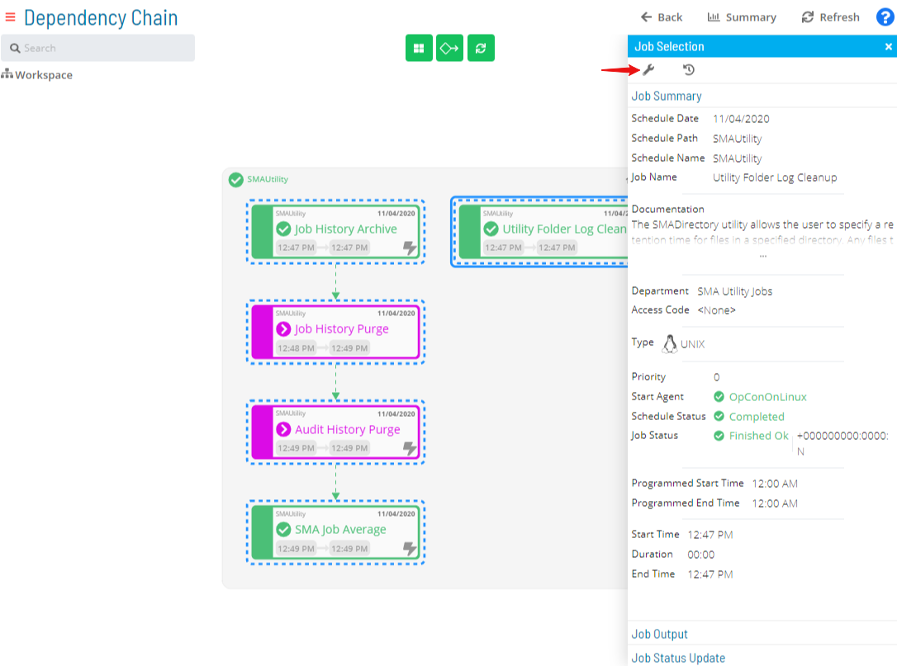

## PERT View Job Executions History Access

In addition to accessing job executions history from the **Processes**
page, it can also be accessed in the PERT View.

In the PERT View, use your mouse to select a single job in the diagram
then right-click on the mouse to display the **Selection** panel. Keep
in mind that a solid royal blue border will appear around the selected
job. At the top-left corner of the panel, click the **Job Executions
History** button, as shown in the graphic. The **Job Executions
History** page will display. Refer to the [Accessing Job Executions History](Accessing-Job-Executions-History.md)
topic to learn more about the options on this page.

Job Executions History Access in PERT View

## PERT View Schedule Status Updates

In addition to performing schedule status changes in the **Processes**
page, schedule status updates can be performed within PERT View. You can
either use your mouse to select a single schedule or simultaneously
press the **Ctrl** key and your mouse to select several schedules in the
PERT diagram. A solid royal blue border appears around any selected
schedule.

Once selected, right-click on the mouse to display the **Selection**
panel with the **Schedule Status Update** tab in focus, as shown in the
graphic. From there, follow [Steps 6 - 9]{.ul} of the [Performing
Schedule Status Changes](Performing-Schedule-Status-Changes.md)
topic to change the schedule status of the selected schedule(s) in the
diagram.

Schedule Status Update in PERT View

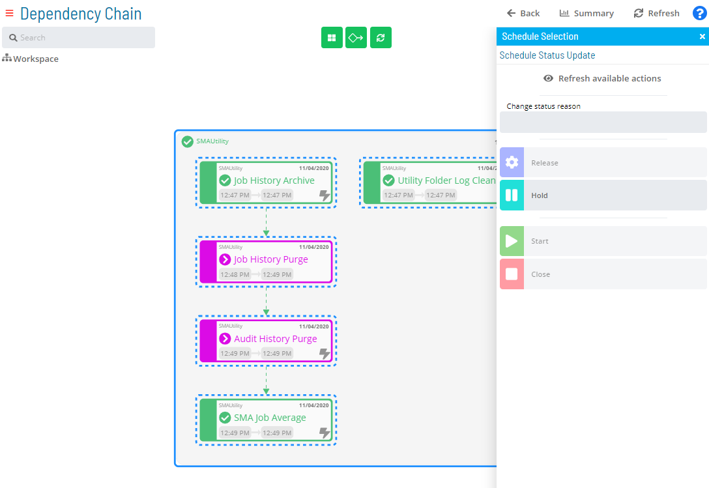

## PERT View Bulk Job Status Updates (Schedule Level)

As can be performed in the **Processes** page, mass action on job status
updates at the schedule level can be performed within PERT View. You can
either use your mouse to select a single schedule or simultaneously
press the **Ctrl** key and your mouse to select several schedules in the
PERT diagram. A solid royal blue border appears around any selected
schedule.

Once any schedule is selected, right-click on the mouse to display the
**Selection** panel. You will then need to select the **Bulk Job Status
Update** accordion-style tab in the panel, as shown in the graphic. From
there, follow [Steps 6 - 9]{.ul} of the [Performing Bulk Job Status
Updates (Schedule
Level)](Performing-Bulk-Job-Status-Updates-Schedule-Level.md)
topic to perform bulk job status updates for the selected schedule(s) in
the diagram.

Bulk Job Status Update (Schedule Level) in PERT View

inPERT.png "Bulk Job Status Update (Schedule Level) in PERT View")

.png "More Info icon")
Related Topics

- [Performing Schedule Status     Changes](Performing-Schedule-Status-Changes.md)
- [Performing Job Status     Changes](Performing-Job-Status-Changes.md)
- [Performing Bulk Status Job Updates (Schedule     Level)](Performing-Bulk-Job-Status-Updates-Schedule-Level.md)
- [Performing Agent Status     Updates](Performing-Agent-Status-Updates.md)
- [Viewing Job Output](Viewing-Job-Output.md)
- [Accessing Job Summary](Accessing-Job-Summary.md)
- [Accessing Daily Job     Definition](Accessing-Daily-Job-Definition.md)
- [Accessing Job Executions     History](Accessing-Job-Executions-History.md)
- [Managing Daily Processes](Managing-Daily-Processes.md)
