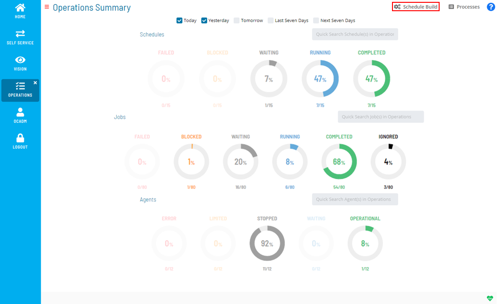
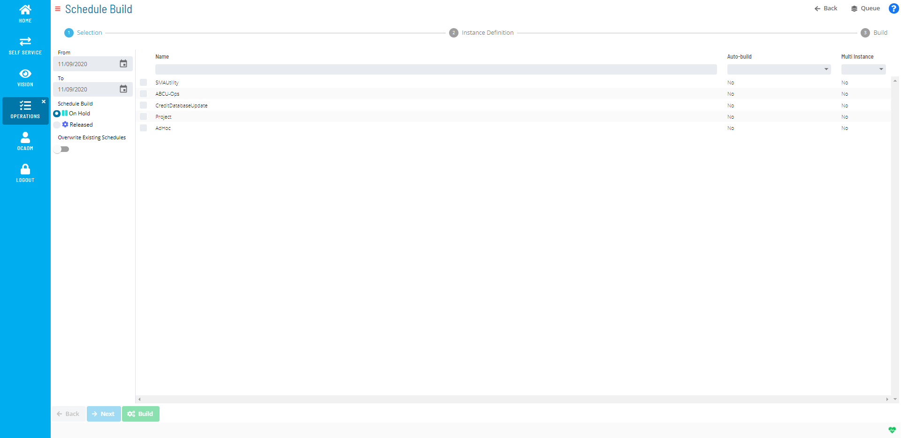
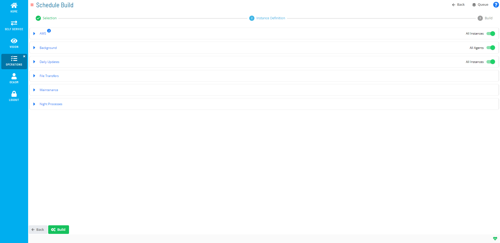
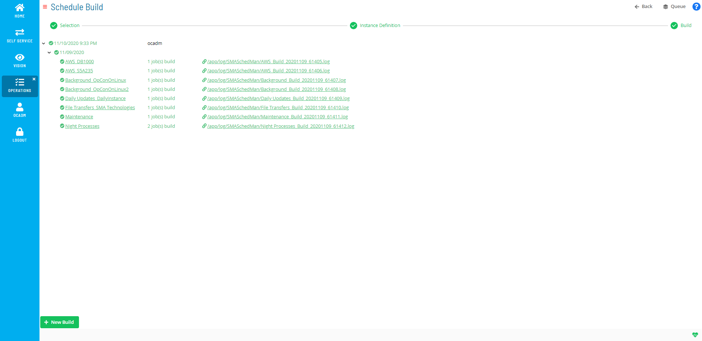
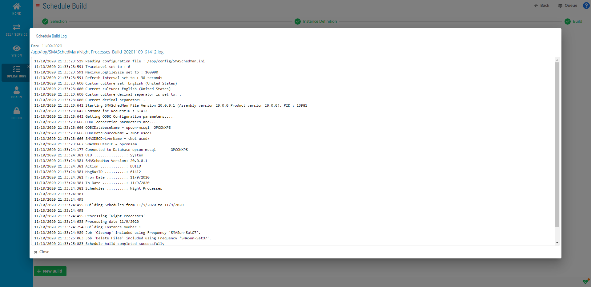

# Using Schedule Build

The 
button on the main **Operations** page takes you to the **Schedule
Build** page where you can manage building schedules.

Operations Summary Page

There are several pages that you can use to build and manage schedules.
These next subsections describe these options in detail.

## Selection Options

Schedule Build Selection Page

The **Selection** page has the following selection options for building
a master schedule:

- **From**: This field allows you to select the earliest date from
    which to build a schedule.
- **To**: This field allows you to select the latest date from which
    to build the schedule.
- **Schedule Build**: These radio buttons allow you to select the
    state in which the schedule will build.
  - **On Hold**: Indicates if the schedule should be built with a
        status of On Hold. The SAM will not process         the schedule until it is released manually or through an OpCon
        event.
  - **Released**: Indicates if the schedule will be released at
        build time.
- **Overwrite Existing Schedules**: When the auto build executes and
    the schedule is found on the target date, this toggle switch
    indicates if the schedule should be overwritten. When this setting
    is on, OpCon overwrites the schedule if it is in a
    [Completed]{.skd-job-statuses} status. If the schedule is [In     Process]{.skd-job-statuses}, it will not be overwritten. The toggle
    switch will appear red 
    when enabled.
- **Name**: This field defines the name of the schedule. Select the
    checkbox 
    to the left of the schedule name for all schedules to be built. For
    quick filtering, use the **Filter Bar** just above the schedule name
    list to filter the list. Type the keyword and click **Enter**, and
    the list will filter accordingly.
- **Auto-build**: This field filters the schedule results based on
    whether the jobs is set to auto build, with options **Yes** or
    **No**. If **Yes**, the number of days in advance details for the
    auto build will be indicated.
- **Multi Instance**: This field filters the schedule results based on
    whether the jobs is a multi-instance schedule, with options **Yes**
    or **No.**
- **Back (bottom-left)**: This button returns to the previous page.
    This button is disabled on the Selection page.
- **Next**: This button progresses to the next page.
- **Build**: This button builds the schedule(s).
- **Back (top-right)**: This button returns to the **Operations
    Summary** page.
- **Queue**: This button opens the [Schedule Build     Queue](Using-Schedule-Build-Queue.md) page.

## Instance Definition Options

Schedule Build Instance Definition Page

The **Instance Definition** page has the following instance definition
options for building a master schedule:

- For non-multi-instance schedules:
  - **Name**: This field allows you to define the property name. If
        the schedule being processed has no defined instances, (refer to
        [Instance         Definition](../../../job-components/instances.md)
        ), the user can enter property definitions for an instance
        of a specific schedule. For additional information, refer to
        [Properties](../../../objects/properties.md#).
  - **Value**: This field allows you to define the property value.
- For multi-instance schedules:
  - **All Instances (Properties/Named Instance)**: This frame allows
        you to select or define properties or named instances for the
        multi-instance schedule. When all instances should be built, the
        All Instances toggle switch will appear green 
        when enabled. A white number in a blue circle ()
        will display next to the schedule name if multiple instances are
        defined for the schedule.
    - **Name**: This field allows you to define the instance name
            or property. If the schedule being processed has no defined
            instances (refer to [Instance Definition](../../../job-components/instances.md)
            ), the user can enter property definitions for an
            instance of a specific schedule. For additional information,
            refer to
            [Properties](../../../objects/properties.md#).
    - **Value**: This field allows you to define the property
            value.
  - **All Agents (Machine Group)**: This frame allows you to select
        or define a machine group for the schedule. When all machines
        should be built, the All Agents toggle switch will appear green
        
        when enabled. A white number in a blue circle ()
        will display next to the schedule name if multiple instances are
        defined for the schedule.
    - **Machine**: This field allows you to select the machine
            group.
- **Back (bottom-left)**: This button returns to the previous page.
- **Build**: This button builds the schedule(s).
- **Back (top-right)**: This button returns to the **Operations
    Summary** page.
- **Queue**: This button opens the [Schedule Build     Queue](Using-Schedule-Build-Queue.md) page.

## Build Options

Schedule Build Page

The **Build** page displays the schedules during building and once
complete. Clicking the schedule name will open the
[Processes](Managing-Daily-Processes.md) page. Clicking the .log
path following the link icon ()
will display the build log.

## Schedule Build Log

Schedule Build Log

The **Schedule Build Log** window displays the path to the log file and
log information for the build.

### Building Schedules

To build a schedule:

1. Click the **Schedule Build** button ()
    on the **Operations Summary** page.
2. Enter or select a start date in the **From** field.
3. Enter or select an end date in the **To** field.
4. Select either the **On Hold** or the **Released** radio button to
    define the build state.
5. Toggle the **Overwrite Existing Schedules** toggle switch to define
    whether to overwrite existing built schedules. The option is
    disabled by default.
6. Select the *checkbox* 
    next to all schedules to be built.
7. Select one of the following options:
    a.  *(Optional)* Click **Next** button to go to the
        **Instance Definition** page (then proceed to step 8) **- or -**
    b.  Click the **Build** button to build the schedule(s) (then
        proceed to step 18).
8. Click the green plus (**Add**) button in the expanded frame to
    define an instance.
9. Enter a *name* and *value* for the property.
    a.  *(Optional)* Click the blue check mark (**OK**)
        button to add the instance property.
    b.  *(Optional)* Click the reverse arrow (**Undo**)
        button to clear the fields.
    c.  *(Optional)* Click the green plus (**Add**)
        button to add an additional instance property.
    d.  *(Optional)* Click the blue pencil (**Edit**)
        button or click in the **Name** or **Value** fields to edit an
        instance property.
    e.  *(Optional)* Click the red trash can
        (**Delete**) button to delete an instance property.
10. *(Optional)* Edit the existing instance definition
    by clicking the blue pencil (**Edit**) button or clicking in the
    **Name** or **Value** fields.
11. *(Optional)* Click the green plus (**Add**) button
    to define an additional instance property.
    a.  Enter a *name* and *value* for the property.
    b.  *(Optional)* Click the blue check mark (**OK**)
        button to add the instance property.
    c.  *(Optional)* Click the reverse arrow (**Undo**)
        button to clear the fields.
    d.  *(Optional)* Click the green plus (**Add**)
        button to add an additional instance property.
    e.  *(Optional)* Click the blue pencil (**Edit**)
        button or click in the **Name** or **Value** fields to edit an
        instance property.
    f.  *(Optional)* Click the red trash can
        (**Delete**) button to delete an instance property.
12. *(Optional)* Toggle the **All Instance** switch to
    define whether to build all instances of the properties.
13. *(Optional)* Edit the existing instance definition
    by clicking the blue pencil (**Edit**) button or clicking in the
    **Name** or **Value** fields.
14. *(Optional)* Click the green plus (**Add**) button
    to define an additional instance property.
    a.  Enter a *name* and *value* for the property.
    b.  *(Optional)* Click the blue check mark (**OK**)
        button to add the instance property.
    c.  *(Optional)* Click the reverse arrow (**Undo**)
        button to clear the fields.
    d.  *(Optional)* Click the green plus (**Add**)
        button to add an additional instance property.
    e.  *(Optional)* Click the blue pencil (**Edit**)
        button or click in the **Name** or **Value** fields to edit an
        instance property.
    f.  *(Optional)* Click the red trash can
        (**Delete**) button to delete an instance property.
15. *(Optional)* Toggle the **All Instance** switch to
    define whether to build all instances of the properties.
16. Select a *machine* in the **Machine** drop-down.
17. *(Optional)* Toggle the **All Agents** switch to
    define whether to build all agents.
18. Click the **Build** button to build the schedule(s).
19. *(Optional)* Click the *schedule name* to view the
    **Processes** information.
20. *(Optional)* Click the *.log file link* to view the
    job log.

.png "More Info icon")
Related Topics

- [Using Schedule Build Queue](Using-Schedule-Build-Queue.md)
:::
