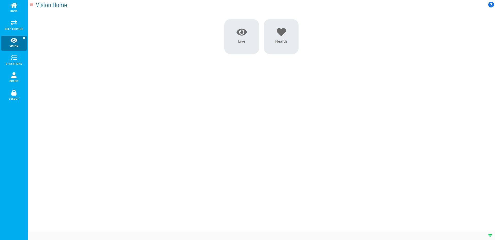

# Working with Vision

Vision is an SMA Solution Manager module that allows you to define cards
that show a summary of the status of all jobs with a matching tag and
view the health of cards based on their historical completion.

Solution Manager Vision

## Vision Live

The Vision Live page allows you to view cards and their statuses. For
more information on cards, refer to [Viewing Cards in Vision Live](Viewing-Cards-in-Vision-Live.md) in the
**Solution Manager** online help.

### Cards

There are two types of cards, group and tag, which can be organized in a
hierarchical structure.

Group cards are parent cards that can be defined at the root level or as
a child card of an existing group. The group card definition must
contain a name, role, and at least one tag card defined at the lowest
group level.

Tag cards can be defined individually at the root level or as child
cards of an existing group. The tag card definition must contain a
pattern (which matches a tag defined in the Enterprise Manager), job
offset, role, and one or more frequencies.

Cards can be assigned frequencies which will determine which days the
card is displayed in the Vision module. When a card is displayed, it
will show a summary containing the start time, duration, end time, and
job statuses for any jobs defined in the Enterprise Manager that match
the pattern defined for the card. If a card is blank, there are no jobs
defined in the Enterprise Manager that match the pattern for that date.

### Job Status Summary

Clicking the 
(vertical ellipsis) icon on a card flips the card to its back which
displays the total number of jobs per job status that match the pattern
defined for a tag card or, when viewing a parent group card, the total
number of jobs per job status that match the pattern(s) defined for all
child cards.

### Filtering

The Filter bar at the top of the page can be used to display cards that
have a job defined based on what is stored in the system for the current
day, the day before, and the day after.

Filtering Options

## Vision Health

Vision Health allows you to view a dashboard of the historical data for
completed Vision cards. For more information on Vision Health, refer to
[Viewing Vision Health](Viewing-Vision-Health.md) in
the **Solution Manager** online help.

## Vision Settings

The Vision Settings page allows you to create, edit, and delete cards
and provides access to the Vision Frequencies, Vision Actions, and
Vision Remote Instances pages for defining and managing those settings.
For more information on these pages, refer to the [Related Topics](#Related_Topics).

## License File Request and Storing

Vision is included with Solution Manager; however, you will need to
obtain a license that will allow access to all features of the Vision
solution. Without the license, you will not have access to Actions,
Triggers, and SLAs. To request and save the license file, follow these
next procedures.

To request the license file:

1. Launch Enterprise Manager.
2. Use menu path: **Help \> About OpCon/xps Enterprise Manager**.
3. Click the **License Information** tab.
4. Select the **System ID** \[e.g., (OpconServer_6410)\] at the end of     the first line.
5. Right-click and select **Copy**.
6. Send an email to <license@smatechnologies.com> to request an updated
    license file for OpCon that includes support for "SMA Vision" and
    paste the System ID into the email request. You should receive the
    license within an hour during regular business hours.
7. Click **OK** to close the **About** dialog.

After SMA Technologies responds to the license request, follow this next procedure to save the license file to the SAM
directory.

To save the license file:

1. Save the file to the **\<Configuration
    Directory\>\\OpConxps\\SAM\\** folder on your OpCon server when you
    receive your license file from [SMA     Technologies]{.GeneralCompanyName}. SAM will automatically pick up
    this new file within 6 hours.
2. *(Optional)* Stop and restart the **SMA OpCon
    Service Manager** in your **Windows Services** tool to pick up the
    file immediately.

.png "More Info icon")
[]{#Related_Topics}Related Topics

- [Viewing Cards in Vision     Live](Viewing-Cards-in-Vision-Live.md)
- [Viewing Vision Health](Viewing-Vision-Health.md)

- [Managing Vision Settings](Managing-Vision-Settings.md)

- [Managing Vision     Frequencies](Managing-Vision-Frequencies.md)
- [Managing Vision Actions](Managing-Vision-Actions.md)

- [Managing Vision Remote     Instances](Managing-Vision-Remote-Instances.md)

:::
