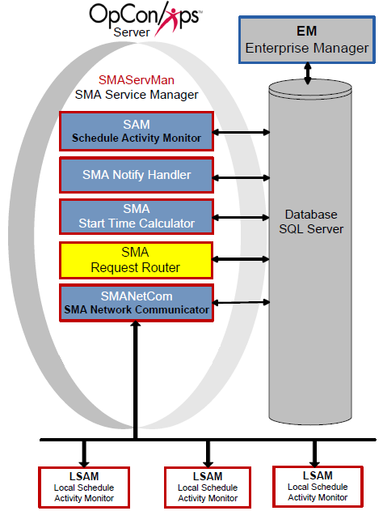

# SMA Request Router

The SMA Request Router component reads the OpCon database to process
requests from the SAM and the Enterprise Manager. After retrieving the
record, the SMA Request Router sends the information to the designated
handler to process the request. When the handler finishes processing the
request, the SMA Request Router writes the completion information to the
OpCon database.

SMA Request Router

## Request Handlers

The following Request Handlers execute OpCon requests:

- [SMASchedMan](#SMASched)
- [LSAMDATARETRIEVER](#LSAMDATA)
- [BIRTPROCESSOR](#BIRTPROC)
- [SAPQUERYPROCESSOR](#SAPQUERY)
- [SAPBWQUERYPROCESSOR](#SAPBWQUE)

### SMASchedMan

The SMASchedMan requests handler builds, checks, and deletes schedules.
For information on configuring SMASchedMan as a Request Handler to the
SMA Request Router, refer to [Request Handler 01](#Request2)
.

#### Processing Schedule Builds

When processing schedule build requests, SMASchedMan builds the
schedules into the Daily tables for the selected dates.

- SMASchedMan evaluates all Multi-instance and SubSchedule settings to
    build the required schedule instances based on the request.
  - For each named instance of a schedule that it builds,
        SMASchedMan creates a property called InstanceName that contains
        the name of \"this\" schedule instance.
    - The property is built as:
            [InstanceName=xxxxx]{style="font-family: 'Courier New';"}         -   The property can be used at runtime in job events.
- The jobs of a schedule must qualify for the selected date(s) to be
    included with the build.
  - For each job in each schedule, SMASchedMan loads the calendar
        for the schedule and any shared holiday calendars (including
        Master), and qualifies the job based on frequency settings for a
        specific date.
  - If a job has the flag set to \"Disable Build\", SMASchedMan will
        not include the job with the schedule.
  - When building a subschedule, if no jobs qualify for the day,
        SMASchedMan creates a Null job called SubScheduleNullJob to
        ensure the subschedule will build and the Container job can
        Finish OK.

#### Processing Schedule Checks

When processing a CHECK, CHECK+, or CHECK- command:

- If a schedule contains a Container job, SMASchedMan inserts a new
    check/check+/check- request for the SubSchedule.
- If the specified Schedule Name is a Schedule Instance Name in the
    Daily tables, only that schedule will be checked.
- If the specified Schedule Name can be found in Administration,
    SMASchedMan will check all instances of the schedule for the
    specified date(s).

#### Processing Schedule Deletes

When processing a DELETE command:

- If a schedule contains a Container job, SMASchedMan inserts a new
    delete request for the subschedule.
- If the specified Schedule Name is a Schedule Instance Name in the
    Daily tables, only that schedule will be deleted.
- If the specified Schedule Name can be found in Administration,
    SMASchedMan will delete all instances of the schedule for the
    specified date(s).

#### Logging

- SMASchedMan always writes its log files to the \<Output
    Directory\>\\SAM\\Log\\SMASchedMan folder.
- If the SMASchedMan folder does not exist, SMASchedMan creates the
    folder before writing the log.
- The log file naming convention is:
    [ScheduleName_Command_YYYYMMDD]{style="font-family: 'Courier New';"}     -   ScheduleName is the name of the schedule that was supposed to
        build.
  - Command is Build, Check, Delete, or Forecast.
  - YYYYMMDD is the schedule date the schedule was supposed to build
        for.

### LSAMDATARETRIEVER

The LSAMDATARETRIEVER request handler processes requests from the Job
Output Retrieval System (JORS). The JORS enables users to view job
output in the graphical interfaces. For information on configuring the
LSAMDATARETRIEVER, refer to [Request Handler 02](#Request3)
.

### BIRTPROCESSOR

The BIRTPROCESSOR request handler processes requests to generate BIRT
reports. The BIRTPROCESSOR picks up the requests from the database and
calls the BIRT generator to create the corresponding reports. The
handler writes all report and log files to the \<Output
Directory\>\\SAM\\Log\\Reports folder. For information on configuring
the BIRTPROCESSOR, refer to [Request Handler 06](#Request4)
.

:::note
The Output Directory was configured during installation. For more information, refer to [File Locations](../file-locations.md) in the **Concepts** online help.
:::

### SAPQUERYPROCESSOR

The SAPQUERYPROCESSOR request handler processes requests from the
graphical interfaces to retrieve information from an SAP system. This
graphical interface requires this request handler for the creation of
SAP jobs. For information on *configuring the SAPQUERYPROCESSOR*, refer
to [Request Handler 03](#Request5).

### SAPBWQUERYPROCESSOR

The SAPBWQUERYPROCESSOR request handler processes requests from the
graphical interfaces to retrieve information from an SAP BW system. This
graphical interfaces require this request handler for the creation of
SAP BW jobs. For information on configuring the SAPBWQUERYPROCESSOR,
refer to [Request Handler 04](#Request6).

## Configuration

SMA Request Router configuration determines basic service and logging
behavior, and Request Handler definitions. The SMARequestRouter.ini file
resides in the \<Configuration Directory\>\\SAM\\ folder. The tables
contain the definitions of each configuration parameter. If a value of
\"Y\" is in the Dynamic column, any changes take effect immediately upon
saving the file. All other configuration settings require the service to
be restarted before the change takes effect.

:::note
The Configuration Directory location is based on where you installed your programs. For more information, refer to [File Locations](../file-locations.md) in the **Concepts** online help.
:::

### SMARequestRouter.ini

The SMARequestRouter.ini file contains the following major sections:

- [General Settings](#General)
- [Debug Options](#Debug)
- [Settings for Individual Request Handlers](#Request2)

#### General Settings

The General Settings contain basic information for SMA Request Router
processing.

+--------------------+---------+---------------+--------------------+
| General Settings   | Default | Dynamic (Y/N) | Definition         |
+====================+=========+===============+====================+
| RefreshInterval    | 5       | Y             | -   The time       |
|                    |         |               |     interval (in   |
|                    |         |               |     seconds) at    |
|                    |         |               |     which the      |
|                    |         |               |     service checks |
|                    |         |               |     for            |
|                    |         |               |     unprocessed    |
|                    |         |               |     requests in    |
|                    |         |               |     the OPCONREQ   |
|                    |         |               |     table.         |
|                    |         |               | -   Valid values:  |
|                    |         |               |     1 through 300  |
|                    |         |               |     seconds        |
+--------------------+---------+---------------+--------------------+
| MaximumP           | 50      | Y             | -   The maximum    |
| arallelReqHandlers |         |               |     number of      |
|                    |         |               |     concurrent     |
|                    |         |               |     request        |
|                    |         |               |     handlers for   |
|                    |         |               |     the SMA        |
|                    |         |               |     Request Router |
|                    |         |               |     to launch.     |
|                    |         |               | -                  |
|                    |         |               |    []{#aanchor400} | |                    |         |               |     Smaller        |
|                    |         |               |     environments   |
|                    |         |               |     may want to    |
|                    |         |               |     lower this     |
|                    |         |               |     number to      |
|                    |         |               |     reduce stress  |
|                    |         |               |     on the SAM     |
|                    |         |               |     server.        |
|                    |         |               | -   Larger         |
|                    |         |               |     environments   |
|                    |         |               |     may want to    |
|                    |         |               |     raise this     |
|                    |         |               |     number to      |
|                    |         |               |     improve use of |
|                    |         |               |     multiple       |
|                    |         |               |     processors and |
|                    |         |               |     high amounts   |
|                    |         |               |     of memory.     |
|                    |         |               | -   Valid Values:  |
|                    |         |               |     10 through     |
|                    |         |               |     1024           |
+--------------------+---------+---------------+--------------------+
| Inte               | 50      | Y             | -   The number of  |
| rvalBetReqHandlers |         |               |     milliseconds   |
|                    |         |               |     for SMA        |
|                    |         |               |     Request Router |
|                    |         |               |     to sleep       |
|                    |         |               |     between        |
|                    |         |               |     launching      |
|                    |         |               |     concurrent     |
|                    |         |               |     request        |
|                    |         |               |     handlers.      |
|                    |         |               | -   Smaller        |
|                    |         |               |     environments   |
|                    |         |               |     may want to    |
|                    |         |               |     raise this     |
|                    |         |               |     number to      |
|                    |         |               |     reduce stress  |
|                    |         |               |     on the SAM     |
|                    |         |               |     server.        |
|                    |         |               | -   Larger         |
|                    |         |               |     environments   |
|                    |         |               |     may want to    |
|                    |         |               |     lower this     |
|                    |         |               |     number to      |
|                    |         |               |     improve use of |
|                    |         |               |     multiple       |
|                    |         |               |     processors and |
|                    |         |               |     high amounts   |
|                    |         |               |     of memory.     |
|                    |         |               | -   Valid Values:  |
|                    |         |               |     10 through     |
|                    |         |               |     3000           |
+--------------------+---------+---------------+--------------------+
| ReqHan             | NORMAL  | Y             | -   Defines the    |
| dlerLaunchPriority |         |               |     Base Priority  |
|                    |         |               |     on Windows for |
|                    |         |               |     each handler.  |
|                    |         |               | -   For large      |
|                    |         |               |     environments,  |
|                    |         |               |     SMA recommends |
|                    |         |               |     using a value  |
|                    |         |               |     of             |
|                    |         |               |     BELOWNORMAL.   |
|                    |         |               |     This value,    |
|                    |         |               |     together with  |
|                    |         |               |     more parallel  |
|                    |         |               |     handlers and a |
|                    |         |               |     shorter sleep  |
|                    |         |               |     time, actually |
|                    |         |               |     increases the  |
|                    |         |               |     throughput of  |
|                    |         |               |     handlers while |
|                    |         |               |     still allowing |
|                    |         |               |     SAM and        |
|                    |         |               |     SMANetCom to   |
|                    |         |               |     process jobs.  |
|                    |         |               | -   Valid Values:  |
|                    |         |               |     NORMAL,        |
|                    |         |               |     ABOVENORMAL,   |
|                    |         |               |     BELOWNORMAL,   |
|                    |         |               |     REALTIME,      |
|                    |         |               |     HIGH, IDLE     |
+--------------------+---------+---------------+--------------------+

: SMA Request Router Configuration: General Settings

#### Debug Options

The Debug Options configure the SMA Request Router\'s logging behavior.

+--------------------+---------+---------------+--------------------+
| Debug Options      | Default | Dynamic (Y/N) | Definition         |
+====================+=========+===============+====================+
| MaximumLogFileSize | 150000  | Y             | -   Defines the    |
|                    |         |               |     maximum size   |
|                    |         |               |     in bytes for   |
|                    |         |               |     each log file. |
|                    |         |               | -   Determines     |
|                    |         |               |     when the       |
|                    |         |               |     current log    |
|                    |         |               |     file is closed |
|                    |         |               |     and a new file |
|                    |         |               |     is started.    |
|                    |         |               |     When the file  |
|                    |         |               |     reaches this   |
|                    |         |               |     maximum size,  |
|                    |         |               |     it is \"rolled |
|                    |         |               |     over.\"        |
|                    |         |               | -   This setting   |
|                    |         |               |     creates small  |
|                    |         |               |     manageable log |
|                    |         |               |     files.         |
|                    |         |               | -   SM             |
|                    |         |               | ARequestRouter.log |
|                    |         |               |     resides in the |
|                    |         |               |     \<Output       |
|                    |         |               |     Dir            |
|                    |         |               | ectory\>\\SAM\\Log |
|                    |         |               |     directory.     |
|                    |         |               | -   When the log   |
|                    |         |               |     file reaches   |
|                    |         |               |     the maximum    |
|                    |         |               |     size, the SMA  |
|                    |         |               |     Request Router |
|                    |         |               |     archives the   |
|                    |         |               |     file. The SAM  |
|                    |         |               |     then maintains |
|                    |         |               |     the archive    |
|                    |         |               |     folders.       |
|                    |         |               | -   Minimum Value  |
|                    |         |               |     = 4096         |
|                    |         |               | -   Maximum Value  |
|                    |         |               |     = 1000000      |
+--------------------+---------+---------------+--------------------+
| TraceLevel         | 0       | Y             | -   Determines the |
|                    |         |               |     detail of      |
|                    |         |               |     debug trace    |
|                    |         |               |     logs.          |
|                    |         |               | -   Valid Entries: |
|                    |         |               |     -   0 = Basic, |
|                    |         |               |                    |
|                    |         |               |       non-detailed |
|                    |         |               |         trace      |
|                    |         |               |     -   1 =        |
|                    |         |               |         Detailed   |
|                    |         |               |         trace      |
|                    |         |               |     -   2 = Very   |
|                    |         |               |         detailed   |
|                    |         |               |         trace      |
|                    |         |               |         (Traces    |
|                    |         |               |         all debug  |
|                    |         |               |                    |
|                    |         |               |        information |
|                    |         |               |         in the     |
|                    |         |               |                    |
|                    |         |               |      application.) |
+--------------------+---------+---------------+--------------------+

: SMA Request Router Configuration: Debug Options

#### Request Handler 01

Configure the request handler SMASchedMan with the parameters specified
in the table.

  RequestHandler01       Default               Dynamic (Y/N)   Description
  ---------------------- --------------------- --------------- --------------------------------------------------------------------------------------
  RequestHandler         SMASchedMan           N               The name of the Request Handler that builds, checks, and deletes schedules.
  RequestExecutable      .\\ SMASchedMan.exe   N               The path and name of the SMASchedMan Request Handler executable.
  RequestExecutionPath   .\\                   N               The working directory for the SMASchedMan Request Handler.
  RequestArguments       \<Blank\>             N               Defines the arguments in the SMASchedMan Request Handler executable\'s command line.

  : SMA Request Router Configuration: SMASchedMan Request Handler 01
  Settings

#### Request Handler 02

Configure the request handler LSAMDATARETRIEVER with the parameters
specified in the table.

  RequestHandler02       Default                       Dynamic (Y/N)   Description
  ---------------------- ----------------------------- --------------- ----------------------------------------------------------------------------------------
  RequestHandler         LSAMDATARETRIEVER             N               Name of the Request Handler for the Job Output Retrieval System (JORS).
  RequestExecutable      .\\SMALSAMDataRetriever.exe   N               The path and name of the LSAMDATARETRIEVER Request Handler executable.
  RequestExecutionPath   .\\                           N               The working directory for the LSAMDATARETRIEVER Request Handler.
  RequestArguments       \<Blank\>                     N               Defines arguments in the LSAMDATARETRIEVER Request Handler executable\'s command line.

  : SMA Request Router Configuration: LSAMDATARETRIEVER Request Handler
  02 Settings

#### Request Handler 03

Configure the request handler SAPQUERYPROCESSOR with the following
parameters.

  RequestHandler03       Default                    Dynamic (Y/N)   Description
  ---------------------- -------------------------- --------------- --------------------------------------------------------------------------------------------
  RequestHandler         SAPQUERYPROCESSOR          N               Name of the Request Handler required for creating SAP jobs.
  RequestExecutable      .\\SAPQueryProcessor.exe   N               The path and name of the SAPQUERYPROCESSOR Request Handler executable.
  RequestExecutionPath   .\\                        N               The working directory for the SAPQUERYPROCESSOR Request Handler.
  RequestArguments       \<Blank\>                  N               Defines the arguments in the SAPQUERYPROCESSOR Request Handler executable\'s command line.

  : SMA Request Router Configuration: SAPQUERYPROCESSOR Request Handler
  03 Settings

#### Request Handler 04

Configure the request handler SAPBWQUERYPROCESSOR with the parameters
specified in the table.

  RequestHandler04       Default                    Dynamic (Y/N)   Description
  ---------------------- -------------------------- --------------- -----------------------------------------------------------------------------------------------
  RequestHandler         SAPBWQUERYPROCESSOR        N               Name of the Request Handler required for creating SAP BW jobs.
  RequestExecutable      .\\SAPQueryProcessor.exe   N               The path and name of the SAPQUERYPROCESSOR Request Handler executable.
  RequestExecutionPath   .\\                        N               The working directory for the SAPBWQUERYPRO-CESSOR Request Handler.
  RequestArguments       \<Blank\>                  N               Defines the arguments in the SAPBWQUERYPRO-CESSOR Request Handler executable\'s command line.

  : SMA Request Router Configuration: SAPBWQUERYPROCESSOR Request
  Handler 04 Settings

#### Request Handler 06

Configure the request handler BIRTPROCESSOR with the parameters
specified in the table.

  RequestHandler06       Default                    Dynamic (Y/N)   Description
  ---------------------- -------------------------- --------------- ----------------------------------------------------------------------------------------
  RequestHandler         BIRTPROCESSOR              N               Name of the Request Handler required to process the report request.
  RequestExecutable      .\\ SMABIRTProcessor.exe   N               The path and name of the BIRTPROCESSOR Request Handler executable.
  RequestExecutionPath   .\\                        N               The working directory for the BIRTPROCESSOR Request Handler.
  RequestArguments       \<Blank\>                  N               Defines the arguments in the BIRTPROCESSOR Request Handler executable\'s command line.

  : SMA Request Router Configuration: BIRTPROCESSOR Request Handler 06
  Settings

### SMALSAMDataRetriever.ini

The SMALSAMDataRetriever.ini file contains the following major sections:

- [General Settings](#General2)
- [Debug Options](#Debug2)

#### General Settings

The General Settings are reserved for future use.

#### Debug Options

The Debug Options configure the SMA LSAM Data Retriever\'s logging
behavior. The SMALSAMDataRetriever.log resides in the \<Output
Directory\>\\SAM\\Log\\ directory.

:::note
The Output Directory was configured during installation. For more information, refer to [File Locations](../file-locations.md) in the **Concepts** online help.
:::

+-------------------+---------+---------------+--------------------+
| Debug Options     | Default | Dynamic (Y/N) | Definition         |
+===================+=========+===============+====================+
| ArchiveDaysToKeep | 15      | N             | -   Sets the       |
|                   |         |               |     number of days |
|                   |         |               |     of log history |
|                   |         |               |     to keep.       |
|                   |         |               | -   Automatic      |
|                   |         |               |     cleanup        |
|                   |         |               |     reduces the    |
|                   |         |               |     disk storage   |
|                   |         |               |     required for   |
|                   |         |               |     logging.       |
+-------------------+---------+---------------+--------------------+
| TraceLevel        | 0       | N             | -   Determines the |
|                   |         |               |     detail of      |
|                   |         |               |     debug trace    |
|                   |         |               |     logs.          |
|                   |         |               | -   Valid Entries: |
|                   |         |               |     -   0 = Basic, |
|                   |         |               |                    |
|                   |         |               |       non-detailed |
|                   |         |               |         trace      |
|                   |         |               |     -   1 =        |
|                   |         |               |         Detailed   |
|                   |         |               |         trace      |
|                   |         |               |     -   2 = Very   |
|                   |         |               |         detailed   |
|                   |         |               |         trace      |
|                   |         |               |         (Traces    |
|                   |         |               |         all the    |
|                   |         |               |         possible   |
|                   |         |               |         debug      |
|                   |         |               |                    |
|                   |         |               |        information |
|                   |         |               |         in the     |
|                   |         |               |                    |
|                   |         |               |      application.) |
+-------------------+---------+---------------+--------------------+

: SMA LSAM Data Retriever Configuration: Debug Options

### SMABIRTPROCESSOR.ini

The SMABIRTPROCESSOR.ini file contains the following major sections:

- [General Settings](#General3)
- [Debug Options](#Debug3)

#### General Settings

  General Settings   Default                        Dynamic (Y/N)   Definition
  ------------------ ------------------------------ --------------- -----------------------------------------------------------------------------------------------
  BIRT_HOME          .\\BIRT\\birt-runtime-2_5\_2   N               Defines the path of the environment variable BIRT_HOME which contains the BIRT runtime files.

  : SMABirtProcessor Configuration: General Settings

#### Debug Options

The Debug Options configure the SMABirtProcessor\'s logging settings.
The SMABirtProcessor.log file resides in the \<Output
Directory\>\\SAM\\Log\\ directory.

:::note
The Output Directory was configured during installation. For more information, refer to [File Locations](../file-locations.md) in the **Concepts** online help.
:::

  Debug Options        Default   Dynamic (Y/N)   Definition
  -------------------- --------- --------------- --------------------------------------------------------------------
  MaximumLogFileSize   150000    N               It is used to define the maximum size of SMABirtProcessor.log file

  : SMABirtProcessor Configuration: Debug Options

### SAPQueryProcessor.ini

The SAPQueryProcessor.ini file contains the following major sections:

- [General Settings](#General4)
- [TCP/IP Parameters](#TCP/IP)
- [Debug Options](#Debug4)

#### General Settings

The General Settings are reserved for future use.

#### TCP/IP Parameters

The TCP/IP Parameters define the socket number for connection to SAP R/3
and SAP BW.

  TCP/IP Parameters   Default   Dynamic (Y/N)   Definition
  ------------------- --------- --------------- ------------------------------------------------------------------
  SocketNumber        1305      N               Defines the Socket number for connection to the SAP R/3 machine.
  BWSocketNumber      13056     N               Defines the Socket number for connection to the SAP BW machine.

#### Debug Options

The Debug Options configure the SAP Query Processor\'s and the
SAPBWQueryProcessor\'s logging behavior. The SAPQueryProcessor.log
contains both SAP and SAP BW Query Processors\' information and resides
in the \<Output Directory\>\\SAM\\Log\\ directory.

:::note
The Output Directory was configured during installation. For more information, refer to [File Locations](../file-locations.md) in the **Concepts** online help.
:::

+--------------------+---------+---------------+--------------------+
| Debug Options      | Default | Dynamic (Y/N) | Definition         |
+====================+=========+===============+====================+
| MaximumLogFileSize | 150000  | N             | -   Defines the    |
|                    |         |               |     maximum size   |
|                    |         |               |     in bytes for   |
|                    |         |               |     each log file. |
|                    |         |               | -   Determines     |
|                    |         |               |     when the       |
|                    |         |               |     current log    |
|                    |         |               |     file is closed |
|                    |         |               |     and a new file |
|                    |         |               |     is started.    |
|                    |         |               |     When the file  |
|                    |         |               |     reaches this   |
|                    |         |               |     maximum size,  |
|                    |         |               |     it is \"rolled |
|                    |         |               |     over.\"        |
|                    |         |               | -   This setting   |
|                    |         |               |     creates small, |
|                    |         |               |     manageable log |
|                    |         |               |     files.         |
|                    |         |               | -   When the log   |
|                    |         |               |     file reaches   |
|                    |         |               |     the maximum    |
|                    |         |               |     size, the SMA  |
|                    |         |               |     Request Router |
|                    |         |               |     archives the   |
|                    |         |               |     file. The SAM  |
|                    |         |               |     then maintains |
|                    |         |               |     the archive    |
|                    |         |               |     folders.       |
|                    |         |               |     -   Minimum    |
|                    |         |               |         Value =    |
|                    |         |               |         4096       |
|                    |         |               |     -   Maximum    |
|                    |         |               |         Value =    |
|                    |         |               |         1000000    |
+--------------------+---------+---------------+--------------------+
| TraceLevel         | 0       | N             | -   Determines the |
|                    |         |               |     detail of      |
|                    |         |               |     debug trace    |
|                    |         |               |     logs.          |
|                    |         |               | -   Valid Entries: |
|                    |         |               |     -   0 = Basic, |
|                    |         |               |                    |
|                    |         |               |       non-detailed |
|                    |         |               |         trace      |
|                    |         |               |     -   1 =        |
|                    |         |               |         Detailed   |
|                    |         |               |         trace      |
|                    |         |               |     -   2 = Very   |
|                    |         |               |         detailed   |
|                    |         |               |         trace      |
|                    |         |               |         (Traces    |
|                    |         |               |         all the    |
|                    |         |               |         possible   |
|                    |         |               |         debug      |
|                    |         |               |                    |
|                    |         |               |        information |
|                    |         |               |         in the     |
|                    |         |               |                    |
|                    |         |               |      application.) |
+--------------------+---------+---------------+--------------------+

: SAP Query Processor Configuration: Debug Options
:::
